# Clawdbot ReAct 循环与可观测性机制深度分析

> 基于源码的技术解析：Tools/Skills 系统、提示词设计、Agent Loop 实现

## 目录

- [概述](#概述)
- [ReAct Loop 核心设计](#react-loop-核心设计)
- [Tools 系统架构](#tools-系统架构)
- [Skills 系统架构](#skills-系统架构)
- [提示词设计](#提示词设计)
- [可观测性机制](#可观测性机制)
- [事件流与状态管理](#事件流与状态管理)

---

## 概述

Clawdbot 采用经典的 **ReAct (Reasoning + Acting)** 模式实现 Agent 循环，核心特点：

1. **流式处理** — 支持消息、工具调用、推理的实时流式输出
2. **事件驱动** — 通过事件系统实现 Agent 各阶段的可观测性
3. **模块化工具** — 工具以插件形式注册，支持动态加载
4. **技能延迟加载** — 技能在运行时按需读取，减少 token 消耗

### 核心代码结构

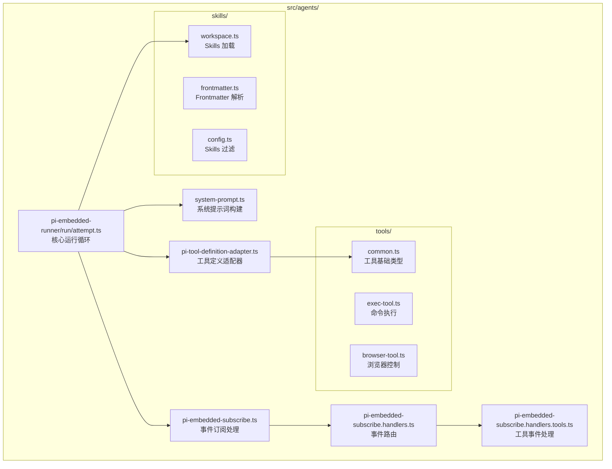
```mermaid
graph TB
    subgraph "src/agents/"
        A[pi-embedded-runner/run/attempt.ts<br/>核心运行循环]
        B[pi-embedded-subscribe.ts<br/>事件订阅处理]
        C[pi-embedded-subscribe.handlers.ts<br/>事件路由]
        D[pi-embedded-subscribe.handlers.tools.ts<br/>工具事件处理]
        E[pi-tool-definition-adapter.ts<br/>工具定义适配器]
        F[system-prompt.ts<br/>系统提示词构建]
        
        subgraph "skills/"
            G[workspace.ts<br/>Skills 加载]
            H[frontmatter.ts<br/>Frontmatter 解析]
            I[config.ts<br/>Skills 过滤]
        end
        
        subgraph "tools/"
            J[common.ts<br/>工具基础类型]
            K[exec-tool.ts<br/>命令执行]
            L[browser-tool.ts<br/>浏览器控制]
        end
    end
    
    A --> B
    A --> F
    A --> G
    B --> C
    C --> D
    A --> E
    E --> J
```

---

## ReAct Loop 核心设计

### Agent Loop 架构

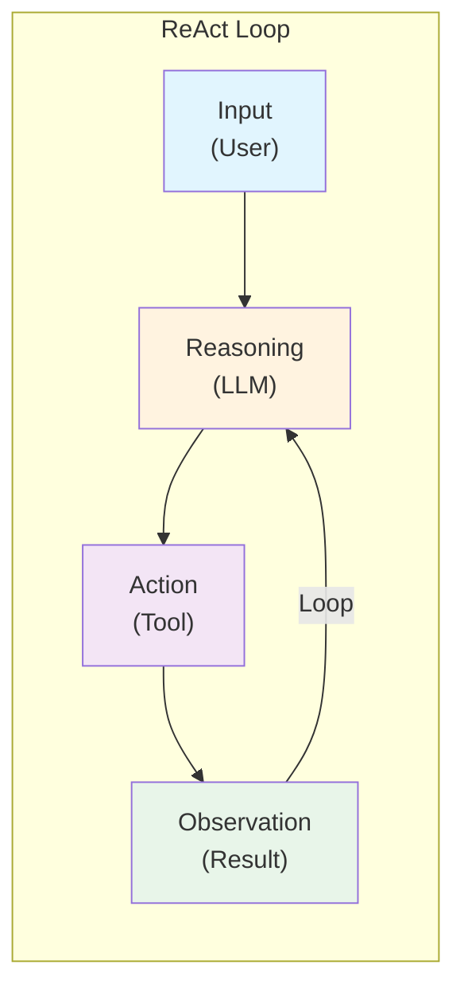
```mermaid
flowchart LR
    subgraph ReAct["ReAct Loop"]
        Input["Input<br/>(User)"] --> Reasoning["Reasoning<br/>(LLM)"]
        Reasoning --> Action["Action<br/>(Tool)"]
        Action --> Observation["Observation<br/>(Result)"]
        Observation --> |Loop| Reasoning
    end
    
    style Input fill:#e1f5fe
    style Reasoning fill:#fff3e0
    style Action fill:#f3e5f5
    style Observation fill:#e8f5e9
```

### 核心函数：`runEmbeddedAttempt()`

位置：`src/agents/pi-embedded-runner/run/attempt.ts`

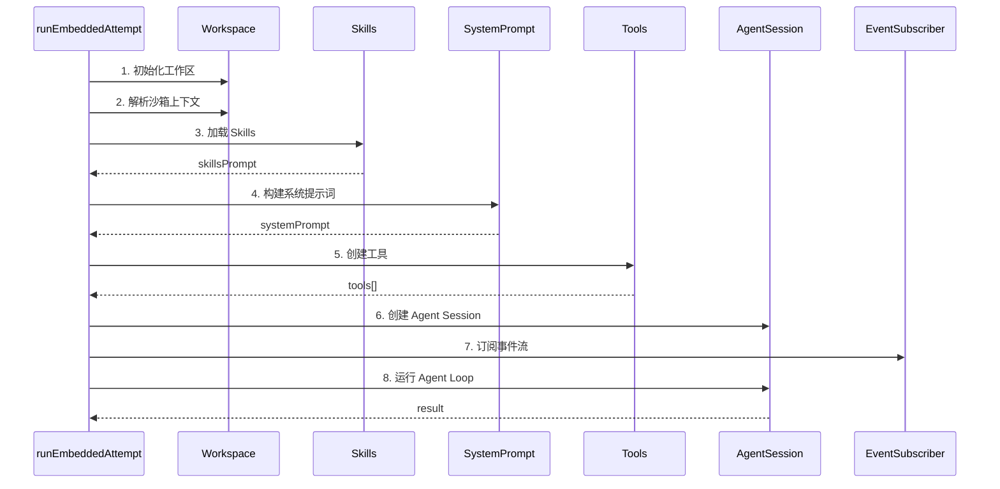
```mermaid
sequenceDiagram
    participant R as runEmbeddedAttempt
    participant W as Workspace
    participant S as Skills
    participant P as SystemPrompt
    participant T as Tools
    participant A as AgentSession
    participant E as EventSubscriber
    
    R->>W: 1. 初始化工作区
    R->>W: 2. 解析沙箱上下文
    R->>S: 3. 加载 Skills
    S-->>R: skillsPrompt
    R->>P: 4. 构建系统提示词
    P-->>R: systemPrompt
    R->>T: 5. 创建工具
    T-->>R: tools[]
    R->>A: 6. 创建 Agent Session
    R->>E: 7. 订阅事件流
    R->>A: 8. 运行 Agent Loop
    A-->>R: result
```

### 事件驱动的 Agent Loop

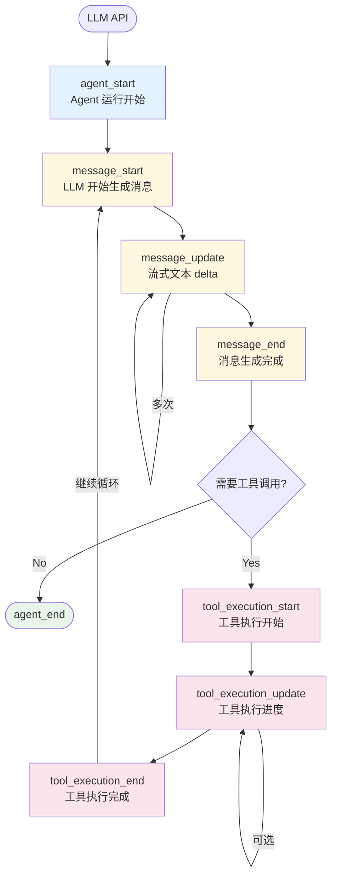
```mermaid
flowchart TD
    Start([LLM API]) --> AgentStart[agent_start<br/>Agent 运行开始]
    AgentStart --> MsgStart[message_start<br/>LLM 开始生成消息]
    MsgStart --> MsgUpdate[message_update<br/>流式文本 delta]
    MsgUpdate --> |多次| MsgUpdate
    MsgUpdate --> MsgEnd[message_end<br/>消息生成完成]
    MsgEnd --> Decision{需要工具调用?}
    
    Decision --> |No| AgentEnd([agent_end])
    Decision --> |Yes| ToolStart[tool_execution_start<br/>工具执行开始]
    ToolStart --> ToolUpdate[tool_execution_update<br/>工具执行进度]
    ToolUpdate --> |可选| ToolUpdate
    ToolUpdate --> ToolEnd[tool_execution_end<br/>工具执行完成]
    ToolEnd --> |继续循环| MsgStart
    
    style AgentStart fill:#e3f2fd
    style MsgStart fill:#fff8e1
    style MsgUpdate fill:#fff8e1
    style MsgEnd fill:#fff8e1
    style ToolStart fill:#fce4ec
    style ToolUpdate fill:#fce4ec
    style ToolEnd fill:#fce4ec
    style AgentEnd fill:#e8f5e9
```

### 事件处理器

位置：`src/agents/pi-embedded-subscribe.handlers.ts`

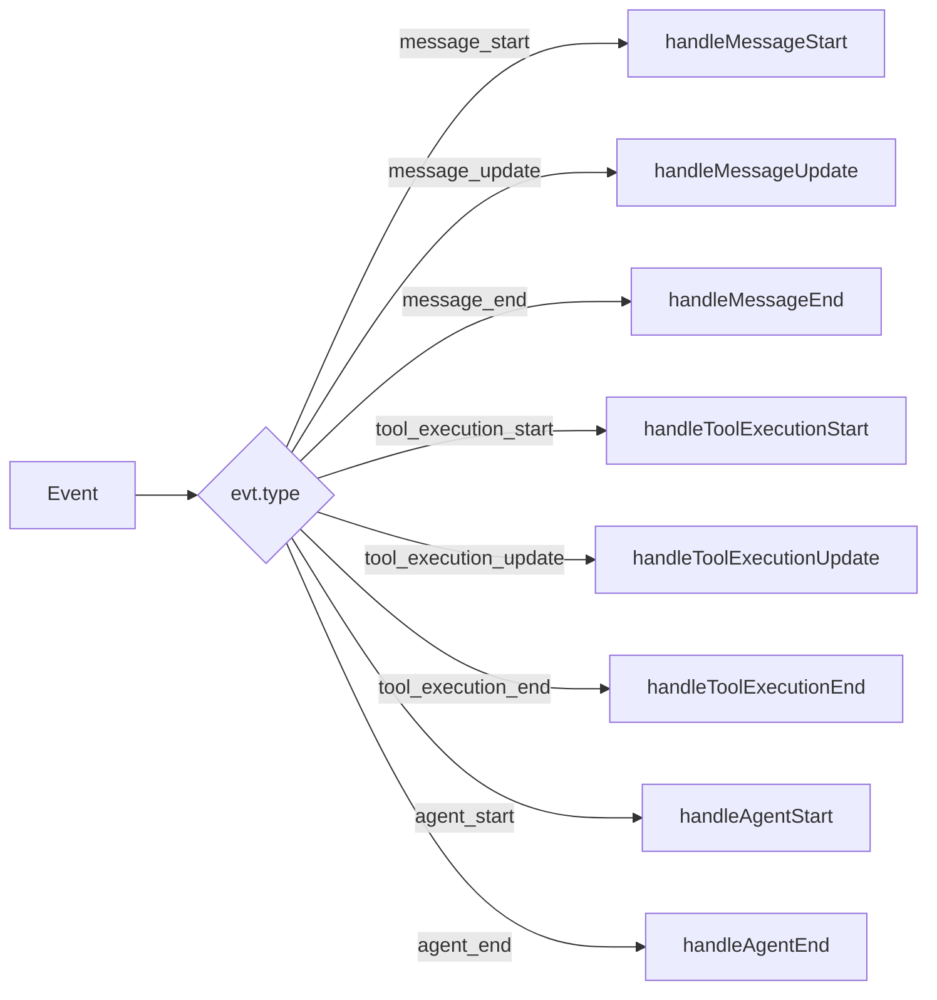
```mermaid
flowchart LR
    Event[Event] --> Switch{evt.type}
    
    Switch --> |message_start| H1[handleMessageStart]
    Switch --> |message_update| H2[handleMessageUpdate]
    Switch --> |message_end| H3[handleMessageEnd]
    Switch --> |tool_execution_start| H4[handleToolExecutionStart]
    Switch --> |tool_execution_update| H5[handleToolExecutionUpdate]
    Switch --> |tool_execution_end| H6[handleToolExecutionEnd]
    Switch --> |agent_start| H7[handleAgentStart]
    Switch --> |agent_end| H8[handleAgentEnd]
```

---

## Tools 系统架构

### 工具定义格式

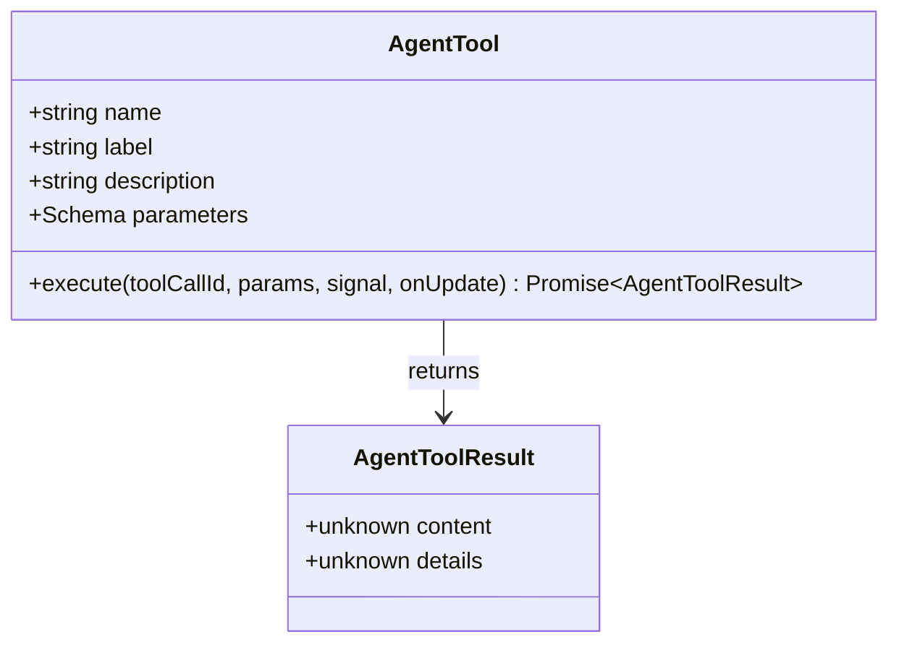
```mermaid
classDiagram
    class AgentTool {
        +string name
        +string label
        +string description
        +Schema parameters
        +execute(toolCallId, params, signal, onUpdate) Promise~AgentToolResult~
    }
    
    class AgentToolResult {
        +unknown content
        +unknown details
    }
    
    AgentTool --> AgentToolResult : returns
```

### 工具注册流程

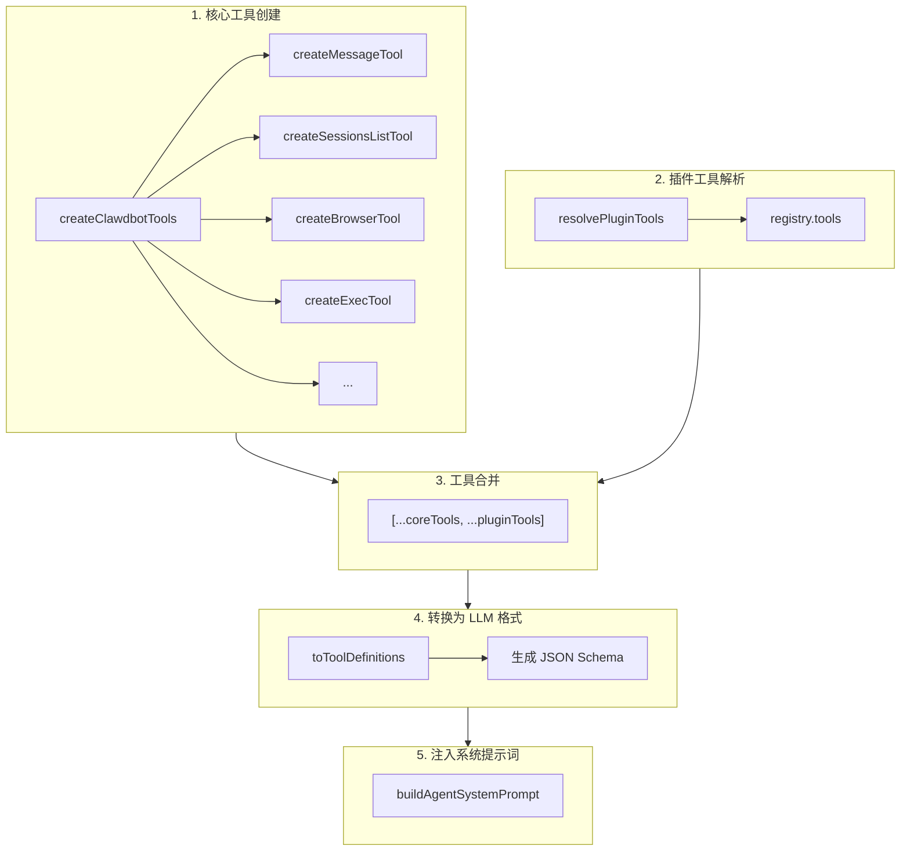
```mermaid
flowchart TB
    subgraph Step1["1. 核心工具创建"]
        A[createClawdbotTools]
        A --> A1[createMessageTool]
        A --> A2[createSessionsListTool]
        A --> A3[createBrowserTool]
        A --> A4[createExecTool]
        A --> A5[...]
    end
    
    subgraph Step2["2. 插件工具解析"]
        B[resolvePluginTools]
        B --> B1[registry.tools]
    end
    
    subgraph Step3["3. 工具合并"]
        C["[...coreTools, ...pluginTools]"]
    end
    
    subgraph Step4["4. 转换为 LLM 格式"]
        D[toToolDefinitions]
        D --> D1[生成 JSON Schema]
    end
    
    subgraph Step5["5. 注入系统提示词"]
        E[buildAgentSystemPrompt]
    end
    
    Step1 --> Step3
    Step2 --> Step3
    Step3 --> Step4
    Step4 --> Step5
```

### 工具执行流程

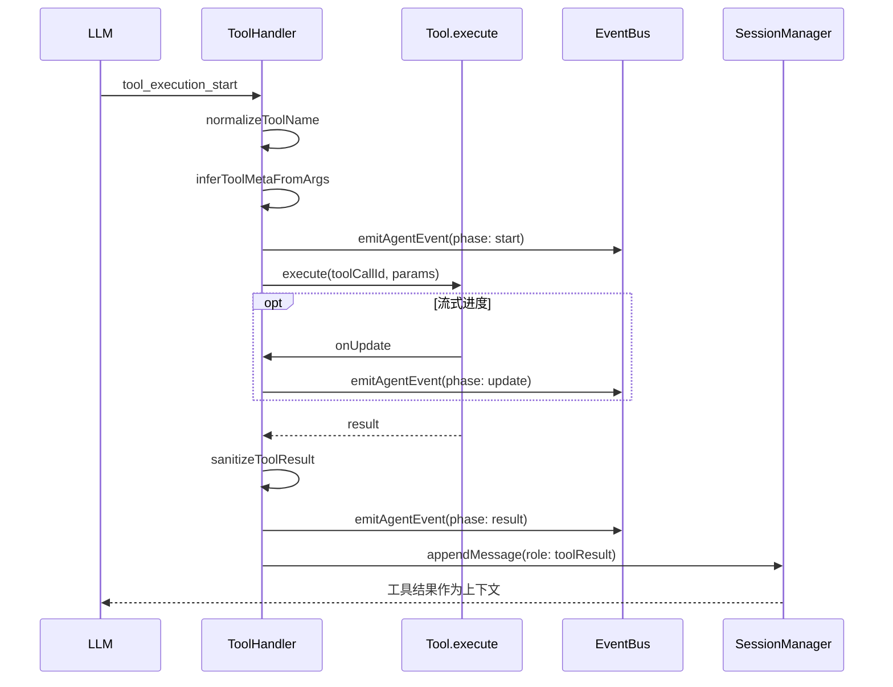
```mermaid
sequenceDiagram
    participant LLM
    participant Handler as ToolHandler
    participant Tool as Tool.execute
    participant Event as EventBus
    participant Session as SessionManager
    
    LLM->>Handler: tool_execution_start
    Handler->>Handler: normalizeToolName
    Handler->>Handler: inferToolMetaFromArgs
    Handler->>Event: emitAgentEvent(phase: start)
    Handler->>Tool: execute(toolCallId, params)
    
    opt 流式进度
        Tool->>Handler: onUpdate
        Handler->>Event: emitAgentEvent(phase: update)
    end
    
    Tool-->>Handler: result
    Handler->>Handler: sanitizeToolResult
    Handler->>Event: emitAgentEvent(phase: result)
    Handler->>Session: appendMessage(role: toolResult)
    Session-->>LLM: 工具结果作为上下文
```

### 工具结果返回 LLM

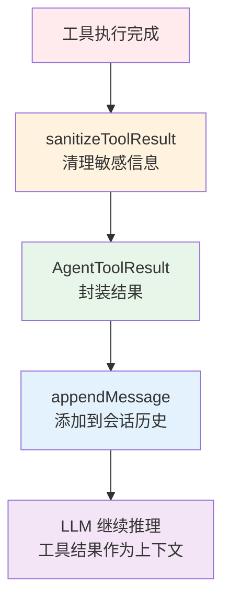
```mermaid
flowchart TB
    A[工具执行完成] --> B[sanitizeToolResult<br/>清理敏感信息]
    B --> C[AgentToolResult<br/>封装结果]
    C --> D[appendMessage<br/>添加到会话历史]
    D --> E[LLM 继续推理<br/>工具结果作为上下文]
    
    style A fill:#ffebee
    style B fill:#fff3e0
    style C fill:#e8f5e9
    style D fill:#e3f2fd
    style E fill:#f3e5f5
```

---

## Skills 系统架构

### Skills 加载流程

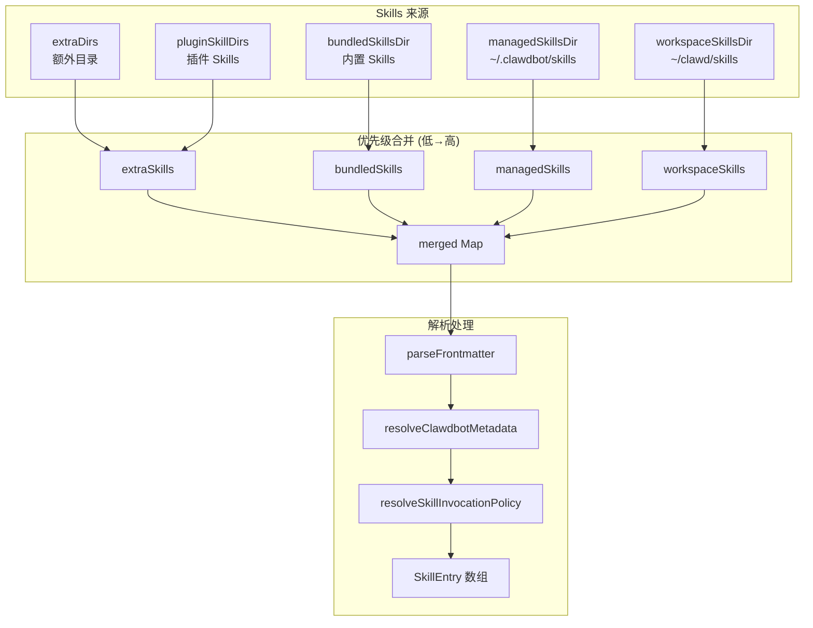
```mermaid
flowchart TB
    subgraph Sources["Skills 来源"]
        S1[bundledSkillsDir<br/>内置 Skills]
        S2[managedSkillsDir<br/>~/.clawdbot/skills]
        S3[workspaceSkillsDir<br/>~/clawd/skills]
        S4[extraDirs<br/>额外目录]
        S5[pluginSkillDirs<br/>插件 Skills]
    end
    
    subgraph Priority["优先级合并 (低→高)"]
        P1[extraSkills] --> Merge
        P2[bundledSkills] --> Merge
        P3[managedSkills] --> Merge
        P4[workspaceSkills] --> Merge
        Merge[merged Map]
    end
    
    subgraph Parse["解析处理"]
        Merge --> F1[parseFrontmatter]
        F1 --> F2[resolveClawdbotMetadata]
        F2 --> F3[resolveSkillInvocationPolicy]
        F3 --> Result[SkillEntry 数组]
    end
    
    S1 --> P2
    S2 --> P3
    S3 --> P4
    S4 --> P1
    S5 --> P1
```

### Skills 过滤机制

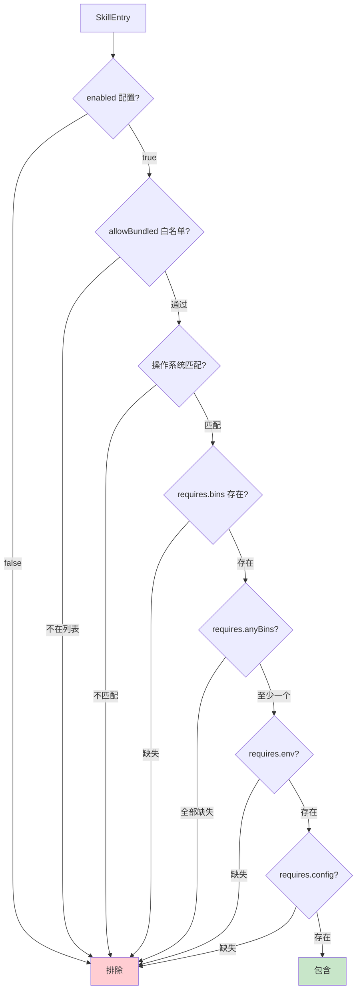
```mermaid
flowchart TB
    Start[SkillEntry] --> C1{enabled 配置?}
    C1 --> |false| Reject[排除]
    C1 --> |true| C2{allowBundled 白名单?}
    
    C2 --> |不在列表| Reject
    C2 --> |通过| C3{操作系统匹配?}
    
    C3 --> |不匹配| Reject
    C3 --> |匹配| C4{requires.bins 存在?}
    
    C4 --> |缺失| Reject
    C4 --> |存在| C5{requires.anyBins?}
    
    C5 --> |全部缺失| Reject
    C5 --> |至少一个| C6{requires.env?}
    
    C6 --> |缺失| Reject
    C6 --> |存在| C7{requires.config?}
    
    C7 --> |缺失| Reject
    C7 --> |存在| Accept[包含]
    
    style Reject fill:#ffcdd2
    style Accept fill:#c8e6c9
```

### Skills Prompt 构建

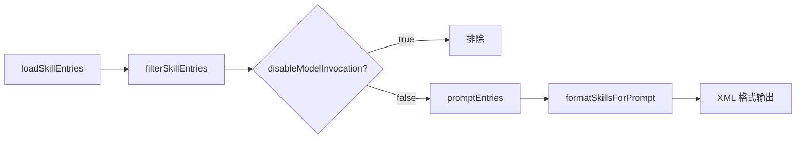
```mermaid
flowchart LR
    A[loadSkillEntries] --> B[filterSkillEntries]
    B --> C{disableModelInvocation?}
    C --> |true| D[排除]
    C --> |false| E[promptEntries]
    E --> F[formatSkillsForPrompt]
    F --> G["XML 格式输出"]
```

**输出格式：**

```xml
<available_skills>
  <skill>
    <name>gemini</name>
    <description>Use Gemini CLI for coding assistance</description>
    <location>/Users/xxx/.clawdbot/skills/gemini/SKILL.md</location>
  </skill>
  <skill>
    <name>peekaboo</name>
    <description>Screenshot and analyze screen content</description>
    <location>/Users/xxx/.clawdbot/skills/peekaboo/SKILL.md</location>
  </skill>
</available_skills>
```

---

## 提示词设计

### 系统提示词结构

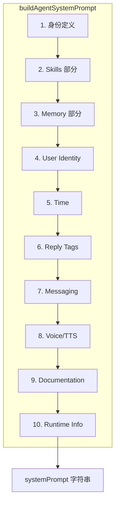
```mermaid
flowchart TB
    subgraph buildAgentSystemPrompt
        A[1. 身份定义] --> B[2. Skills 部分]
        B --> C[3. Memory 部分]
        C --> D[4. User Identity]
        D --> E[5. Time]
        E --> F[6. Reply Tags]
        F --> G[7. Messaging]
        G --> H[8. Voice/TTS]
        H --> I[9. Documentation]
        I --> J[10. Runtime Info]
    end
    
    J --> Output[systemPrompt 字符串]
```

### Skills Section 设计

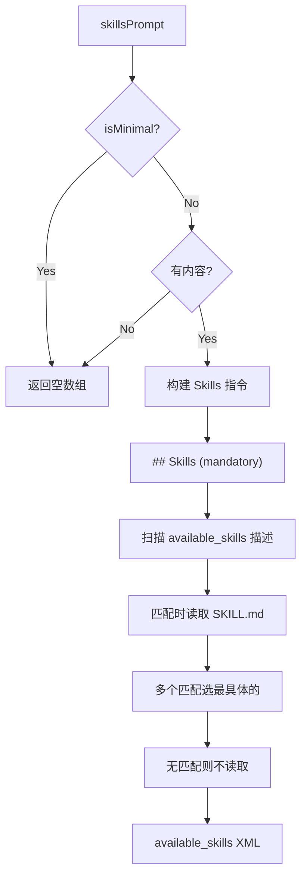
```mermaid
flowchart TB
    Input[skillsPrompt] --> Check1{isMinimal?}
    Check1 --> |Yes| Empty[返回空数组]
    Check1 --> |No| Check2{有内容?}
    Check2 --> |No| Empty
    Check2 --> |Yes| Build[构建 Skills 指令]
    
    Build --> L1["## Skills (mandatory)"]
    L1 --> L2["扫描 available_skills 描述"]
    L2 --> L3["匹配时读取 SKILL.md"]
    L3 --> L4["多个匹配选最具体的"]
    L4 --> L5["无匹配则不读取"]
    L5 --> L6["available_skills XML"]
```

### 提示词模式

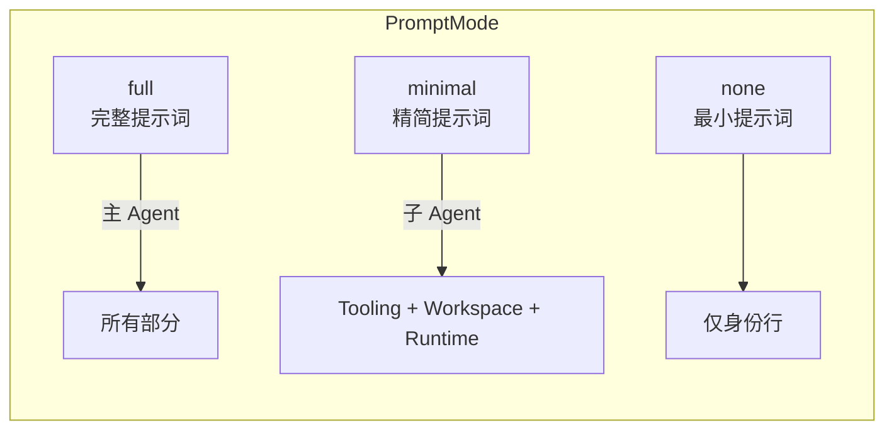
```mermaid
graph LR
    subgraph PromptMode
        A[full<br/>完整提示词] --> |主 Agent| A1[所有部分]
        B[minimal<br/>精简提示词] --> |子 Agent| B1[Tooling + Workspace + Runtime]
        C[none<br/>最小提示词] --> C1[仅身份行]
    end
```

---

## 可观测性机制

### 事件发射系统

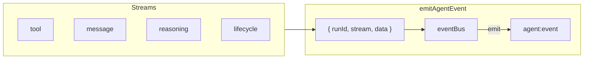
```mermaid
flowchart LR
    subgraph emitAgentEvent
        Input["{ runId, stream, data }"]
        Input --> Bus[eventBus]
        Bus --> |emit| Listener["agent:event"]
    end
    
    subgraph Streams
        S1[tool]
        S2[message]
        S3[reasoning]
        S4[lifecycle]
    end
    
    Streams --> Input
```

### 工具可观测性事件流

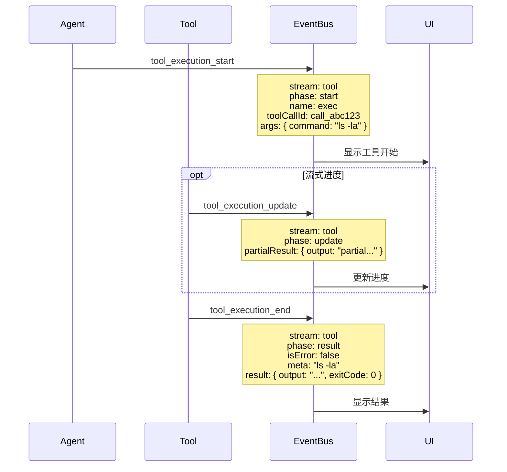
```mermaid
sequenceDiagram
    participant Agent
    participant Tool
    participant EventBus
    participant UI
    
    Agent->>EventBus: tool_execution_start
    Note over EventBus: stream: tool<br/>phase: start<br/>name: exec<br/>toolCallId: call_abc123<br/>args: { command: "ls -la" }
    EventBus->>UI: 显示工具开始
    
    opt 流式进度
        Tool->>EventBus: tool_execution_update
        Note over EventBus: stream: tool<br/>phase: update<br/>partialResult: { output: "partial..." }
        EventBus->>UI: 更新进度
    end
    
    Tool->>EventBus: tool_execution_end
    Note over EventBus: stream: tool<br/>phase: result<br/>isError: false<br/>meta: "ls -la"<br/>result: { output: "...", exitCode: 0 }
    EventBus->>UI: 显示结果
```

### 消息可观测性事件流

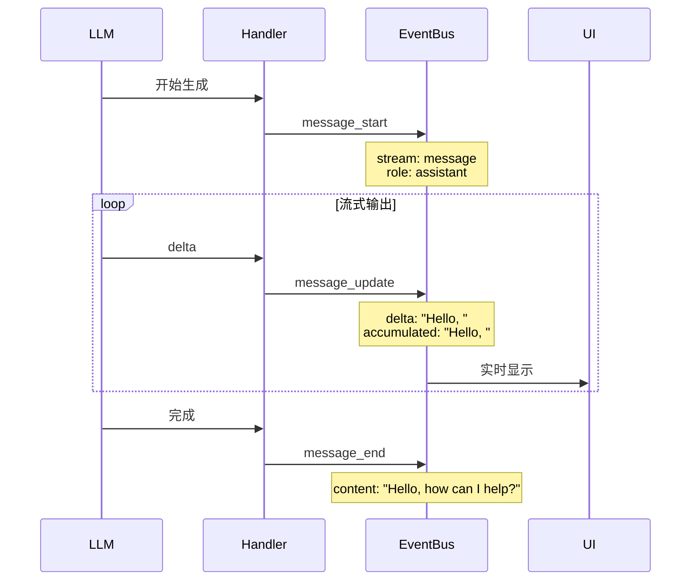
```mermaid
sequenceDiagram
    participant LLM
    participant Handler
    participant EventBus
    participant UI
    
    LLM->>Handler: 开始生成
    Handler->>EventBus: message_start
    Note over EventBus: stream: message<br/>role: assistant
    
    loop 流式输出
        LLM->>Handler: delta
        Handler->>EventBus: message_update
        Note over EventBus: delta: "Hello, "<br/>accumulated: "Hello, "
        EventBus->>UI: 实时显示
    end
    
    LLM->>Handler: 完成
    Handler->>EventBus: message_end
    Note over EventBus: content: "Hello, how can I help?"
```

### 推理可观测性 (Thinking)

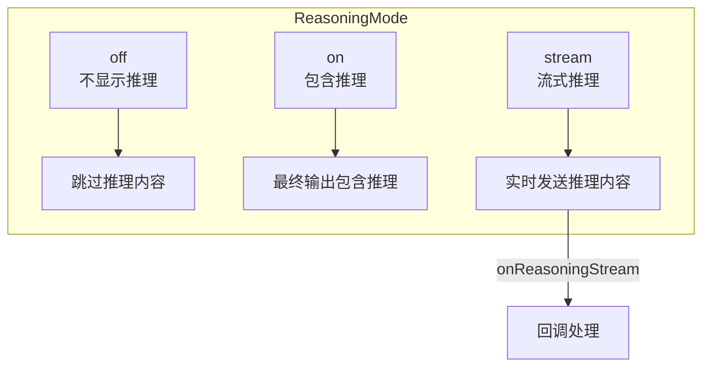
```mermaid
flowchart TB
    subgraph ReasoningMode
        A[off<br/>不显示推理] --> A1[跳过推理内容]
        B[on<br/>包含推理] --> B1[最终输出包含推理]
        C[stream<br/>流式推理] --> C1[实时发送推理内容]
    end
    
    C1 --> |onReasoningStream| Callback[回调处理]
```

---

## 事件流与状态管理

### 订阅上下文状态

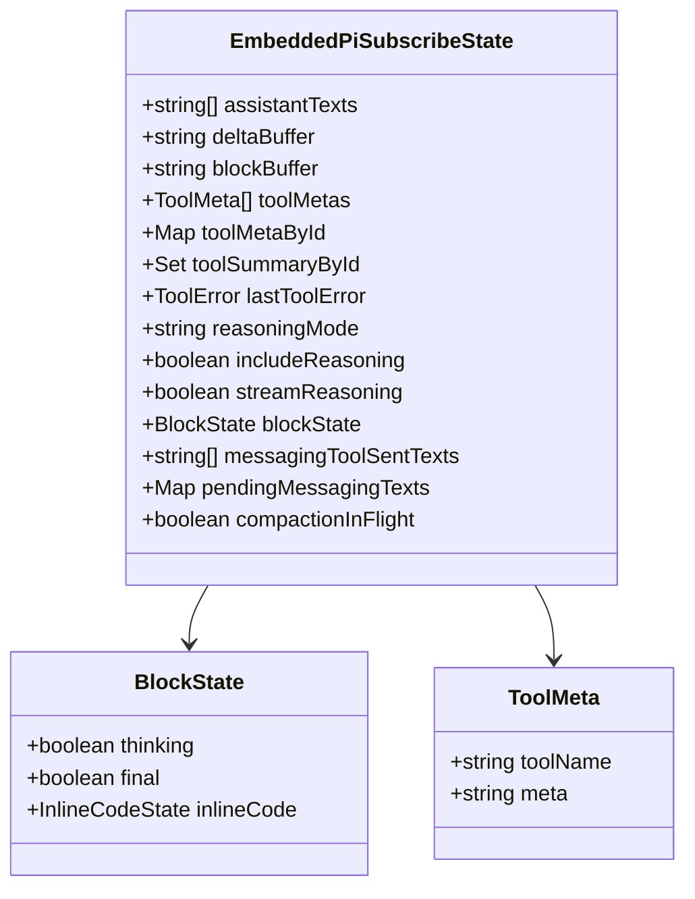
```mermaid
classDiagram
    class EmbeddedPiSubscribeState {
        +string[] assistantTexts
        +string deltaBuffer
        +string blockBuffer
        +ToolMeta[] toolMetas
        +Map toolMetaById
        +Set toolSummaryById
        +ToolError lastToolError
        +string reasoningMode
        +boolean includeReasoning
        +boolean streamReasoning
        +BlockState blockState
        +string[] messagingToolSentTexts
        +Map pendingMessagingTexts
        +boolean compactionInFlight
    }
    
    class BlockState {
        +boolean thinking
        +boolean final
        +InlineCodeState inlineCode
    }
    
    class ToolMeta {
        +string toolName
        +string meta
    }
    
    EmbeddedPiSubscribeState --> BlockState
    EmbeddedPiSubscribeState --> ToolMeta
```

### 块分割与流式回复

```mermaid
flowchart LR
    subgraph BlockReplyBreak
        A[text_end<br/>文本结束时发送]
        B[paragraph<br/>段落结束时发送]
        C[sentence<br/>句子结束时发送]
        D[chunk<br/>固定大小分块]
    end
    
    BlockReplyBreak --> Chunker[EmbeddedBlockChunker]
    Chunker --> |minChars: 800| Output
    Chunker --> |maxChars: 1200| Output
    Output[分块输出]
```

### 完整事件流示例

```mermaid
sequenceDiagram
    participant User
    participant Agent
    participant LLM
    participant Tool as exec Tool
    participant EventBus
    
    User->>Agent: "帮我列出当前目录的文件"
    
    Agent->>EventBus: agent_start
    Agent->>LLM: 请求
    
    LLM->>EventBus: message_start (role: assistant)
    LLM->>EventBus: message_update (delta: "好的，我来")
    LLM->>EventBus: message_update (delta: "查看一下...")
    LLM->>EventBus: message_end
    
    LLM->>EventBus: tool_execution_start (exec, ls -la)
    Agent->>Tool: 执行 ls -la
    Tool-->>Agent: 结果
    Agent->>EventBus: tool_execution_end (result)
    
    LLM->>EventBus: message_start (role: assistant)
    LLM->>EventBus: message_update (delta: "当前目录包含...")
    LLM->>EventBus: message_end
    
    Agent->>EventBus: agent_end
    Agent-->>User: 完整回复
```

---

## 总结

### Clawdbot ReAct 循环的核心特点

```mermaid
mindmap
  root((Clawdbot ReAct))
    事件驱动架构
      状态变化通过事件流
      完整可观测性
    流式处理
      消息流式输出
      推理流式输出
      工具进度更新
    模块化工具
      插件形式注册
      动态加载
      权限控制
    技能延迟加载
      提示词声明列表
      按需读取内容
      减少 token 消耗
    状态隔离
      独立订阅状态
      支持并发执行
```

### 关键设计决策

| 设计 | 选择 | 原因 |
|------|------|------|
| 工具调用 | Function Calling | 利用 LLM 原生能力 |
| 技能注入 | XML 列表 + 延迟读取 | 减少初始 token 消耗 |
| 事件系统 | 分阶段事件 | 支持细粒度可观测性 |
| 流式回复 | 块分割策略 | 平衡响应速度和完整性 |
| 状态管理 | 订阅上下文 | 隔离并发运行 |

### 可观测性能力

```mermaid
graph TB
    subgraph 可观测性
        A[工具调用] --> A1[开始事件]
        A --> A2[进度事件]
        A --> A3[结果事件]
        
        B[消息生成] --> B1[开始事件]
        B --> B2[delta 事件]
        B --> B3[结束事件]
        
        C[推理过程] --> C1[可选流式输出]
        
        D[错误追踪] --> D1[工具错误记录]
        D --> D2[错误传播]
        
        E[元信息] --> E1[参数推断]
        E --> E2[摘要生成]
    end
```
