# Clawdbot Telegram 通信机制详解

> 本文详细解析 Clawdbot 如何与 Telegram Bot API 进行通信，为什么不需要内网穿透，以及两种通信模式的选择。

---

## 目录

1. [核心问题：内网服务如何被外网访问？](#核心问题内网服务如何被外网访问)
2. [Gateway 安全绑定机制](#gateway-安全绑定机制)
3. [两种通信模式对比](#两种通信模式对比)
4. [Long Polling 详解（默认模式）](#long-polling-详解默认模式)
5. [Webhook 模式详解](#webhook-模式详解)
6. [网络拓扑图解](#网络拓扑图解)
7. [配置参考](#配置参考)
8. [常见问题](#常见问题)

---

## 核心问题：内网服务如何被外网访问？

当你在内网（家庭/公司网络）运行 Clawdbot Gateway 时，一个自然的疑问是：

> **Telegram 服务器在公网，我的 Gateway 在内网，它们是如何通信的？**

答案是：**Clawdbot 默认使用 Long Polling 模式，所有通信都是由 Gateway 主动发起的出站请求**。

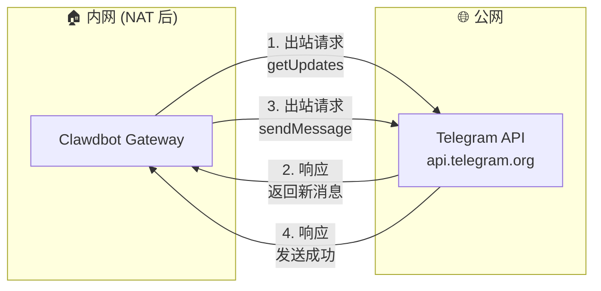

**关键点**：
- ✅ Gateway → Telegram：出站请求，**不受 NAT/防火墙限制**
- ❌ Telegram → Gateway：入站请求，**需要公网地址**（仅 Webhook 模式需要）

---

## Gateway 安全绑定机制

### 默认配置：仅本机可访问

Clawdbot Gateway 默认绑定到 `127.0.0.1`（loopback 回环地址），这意味着：

```bash
$ clawdbot gateway status
Gateway: bind=loopback (127.0.0.1), port=18789
Probe note: Loopback-only gateway; only local clients can connect.
Listening: 127.0.0.1:18789
```

**外网完全无法访问你的 Gateway**，这是设计如此的安全特性。

### 网络可达性图解

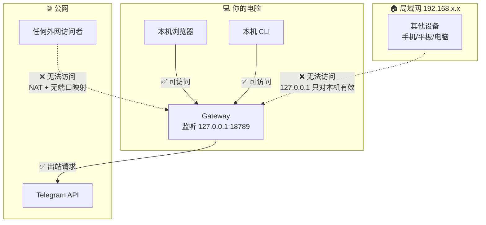

### 三层安全保护

| 层级 | 保护机制 | 说明 |
|------|---------|------|
| **第 1 层** | 绑定地址 `127.0.0.1` | 只监听本地回环接口，连局域网设备都无法访问 |
| **第 2 层** | NAT/防火墙 | 路由器默认不转发入站请求到内网设备 |
| **第 3 层** | 无端口映射 | 即使有人知道你的公网 IP，也没有端口可连 |

### 不同绑定模式对比

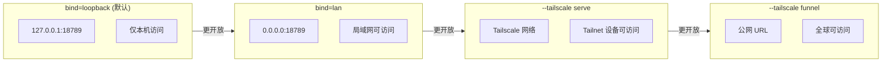

| 绑定模式 | 监听地址 | 可访问范围 | 使用场景 |
|---------|---------|-----------|---------|
| `loopback` (默认) | `127.0.0.1` | 仅本机 | 个人使用，最安全 |
| `lan` | `0.0.0.0` | 局域网内所有设备 | 家庭多设备共享 |
| `--tailscale serve` | Tailscale 网络 | Tailnet 内设备 | 远程访问自己的设备 |
| `--tailscale funnel` | 公网 URL | 全球任何人 | Webhook 模式 |

### 如何修改绑定模式

```bash
# 允许局域网访问
clawdbot gateway --bind lan

# 通过 Tailscale 暴露给自己的设备
clawdbot gateway --tailscale serve

# 暴露到公网（用于 Webhook）
clawdbot gateway --tailscale funnel
```

### 安全建议

1. **个人使用**：保持默认的 `loopback` 绑定，最安全
2. **局域网共享**：使用 `--bind lan`，但确保路由器防火墙正常
3. **远程访问**：优先使用 Tailscale，避免直接暴露端口
4. **Webhook 模式**：使用 Tailscale Funnel 或 Cloudflare Tunnel，不要直接端口映射

---

## 两种通信模式对比

Telegram Bot API 支持两种获取消息的方式：

| 特性 | Long Polling（默认） | Webhook |
|------|---------------------|---------|
| **通信方向** | Gateway → Telegram（出站） | Telegram → Gateway（入站） |
| **公网地址** | ❌ 不需要 | ✅ 必须 |
| **内网穿透** | ❌ 不需要 | ✅ 需要 |
| **SSL 证书** | ❌ 不需要 | ✅ 必须 HTTPS |
| **实时性** | 准实时（~1-2秒延迟） | 实时（推送） |
| **资源消耗** | 持续连接，略高 | 按需触发，较低 |
| **部署复杂度** | ⭐ 简单 | ⭐⭐⭐ 复杂 |
| **适用场景** | 个人/小规模 | 高并发/生产环境 |

---

## Long Polling 详解（默认模式）

### 什么是 Long Polling？

Long Polling（长轮询）是一种"伪推送"技术：

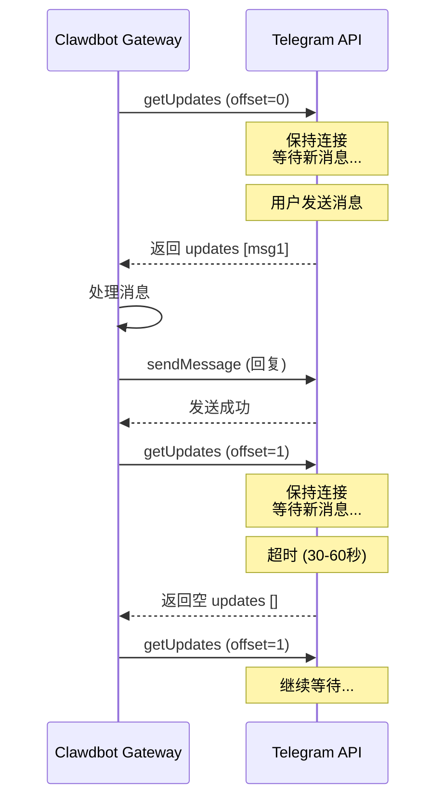

### 工作流程

1. **发起请求** - Gateway 向 `api.telegram.org/bot<token>/getUpdates` 发送 HTTP 请求
2. **服务器等待** - Telegram 服务器保持连接，直到：
   - 有新消息到达 → 立即返回
   - 超时（默认 30-60 秒）→ 返回空结果
3. **处理响应** - Gateway 处理收到的消息
4. **循环请求** - 立即发起下一个 `getUpdates` 请求

### 为什么不需要内网穿透？

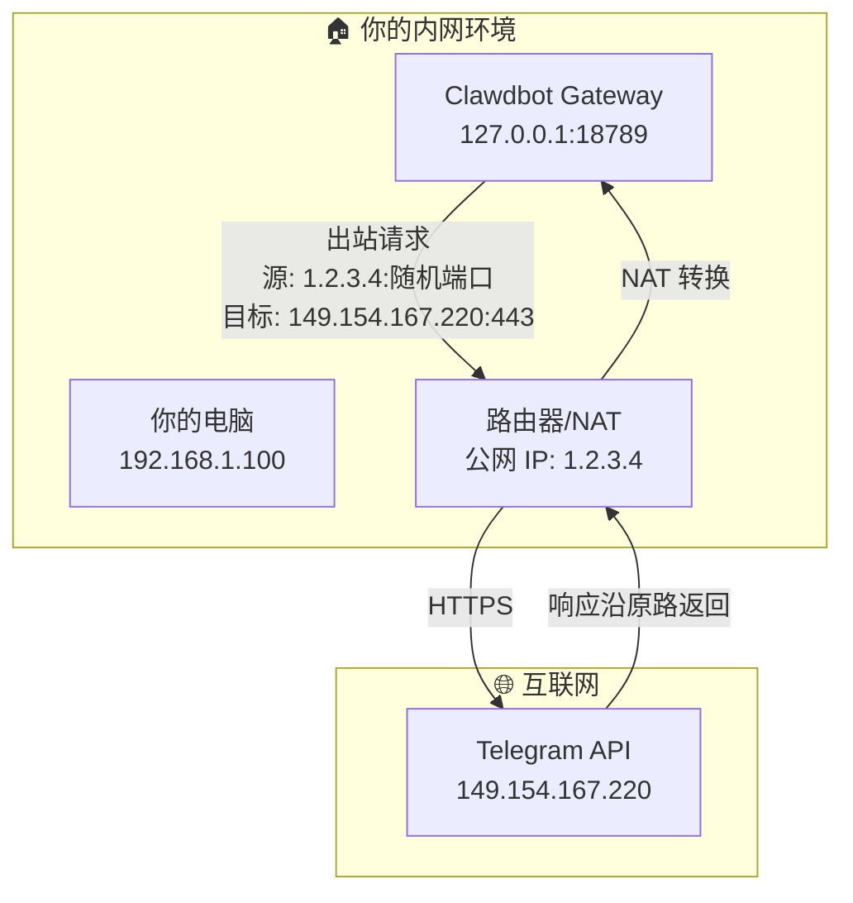

**NAT 穿透原理**：
- 出站连接会在 NAT 表中创建映射
- 响应数据包匹配映射，自动路由回内网
- 这是 TCP/IP 的标准行为，不需要特殊配置

### Clawdbot 的 Long Polling 实现

Clawdbot 使用 [grammY](https://grammy.dev/) 框架，具备：

- **并发控制** - `agents.defaults.maxConcurrent` 限制并发处理数
- **消息序列化** - 同一聊天的消息按顺序处理
- **断线重连** - 自动处理网络中断
- **冲突检测** - 检测其他实例的 `getUpdates` 冲突

---

## Webhook 模式详解

### 什么是 Webhook？

Webhook 是真正的"推送"模式：Telegram 服务器主动向你的服务器发送 HTTP POST 请求。

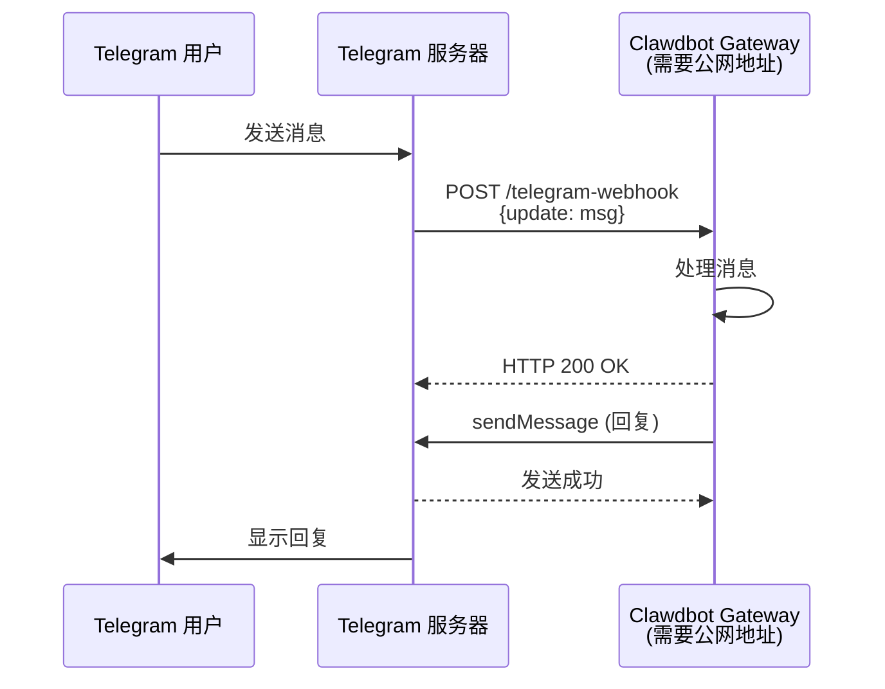

### 为什么需要公网地址？

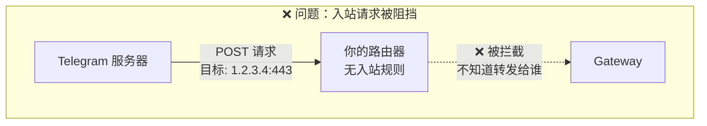

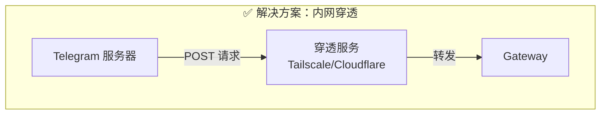

### Webhook 配置

```json5
{
  "channels": {
    "telegram": {
      "enabled": true,
      "botToken": "123456:ABC-DEF",
      
      // Webhook 配置
      "webhookUrl": "https://your-domain.com/telegram-webhook",
      "webhookSecret": "your-random-secret-string",
      "webhookPath": "/telegram-webhook"  // 本地监听路径
    }
  }
}
```

### 内网穿透方案

#### 方案 1：Tailscale Funnel（推荐）

```bash
# 启动 Gateway 并开启 Tailscale Funnel
clawdbot gateway --tailscale funnel
```

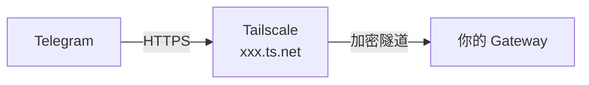

#### 方案 2：Cloudflare Tunnel

```bash
# 安装 cloudflared
brew install cloudflared

# 创建隧道
cloudflared tunnel create clawdbot
cloudflared tunnel route dns clawdbot your-domain.com

# 运行隧道
cloudflared tunnel run --url http://localhost:8787 clawdbot
```

#### 方案 3：ngrok

```bash
ngrok http 8787
# 获取公网 URL: https://xxx.ngrok.io
```

---

## 网络拓扑图解

### 完整架构

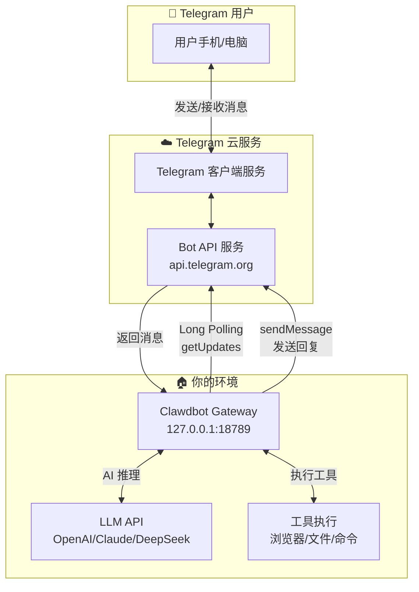

### 消息处理时序

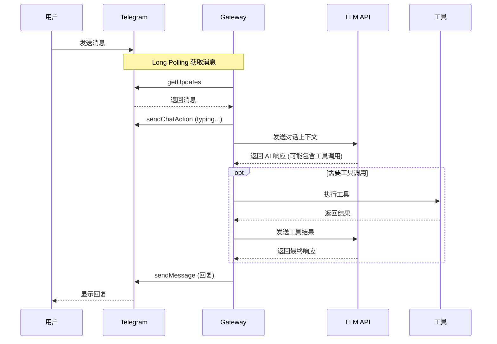

---

## 配置参考

### 最小配置（Long Polling）

```json5
{
  "channels": {
    "telegram": {
      "enabled": true,
      "botToken": "123456789:ABCdefGHIjklMNOpqrsTUVwxyz",
      "dmPolicy": "pairing"
    }
  }
}
```

### 完整配置选项

```json5
{
  "channels": {
    "telegram": {
      // 基础配置
      "enabled": true,
      "botToken": "123456789:ABCdefGHIjklMNOpqrsTUVwxyz",
      
      // 访问控制
      "dmPolicy": "pairing",           // pairing | allowlist | open | disabled
      "allowFrom": ["123456789"],      // 允许的用户 ID
      "groupPolicy": "allowlist",      // open | allowlist | disabled
      
      // Webhook 配置（可选，不配置则使用 Long Polling）
      // "webhookUrl": "https://your-domain.com/telegram-webhook",
      // "webhookSecret": "random-secret",
      // "webhookPath": "/telegram-webhook",
      
      // 消息配置
      "textChunkLimit": 4000,          // 消息分块大小
      "mediaMaxMb": 5,                 // 媒体文件大小限制
      "timeoutSeconds": 500,           // API 超时时间
      
      // 代理配置（可选）
      "proxy": "socks5://127.0.0.1:1080",
      
      // 重试策略
      "retry": {
        "attempts": 3,
        "minDelayMs": 1000,
        "maxDelayMs": 30000
      }
    }
  }
}
```

---

## 常见问题

### Q1: Long Polling 会不会很耗资源？

**A**: 资源消耗很小。Long Polling 使用单个持久 HTTP 连接，大部分时间处于等待状态，CPU 和内存占用极低。

### Q2: 消息延迟高吗？

**A**: 延迟通常在 1-2 秒内。当有新消息时，Telegram 会立即返回，延迟主要来自：
- 网络往返时间
- LLM 推理时间

### Q3: 断网后会丢消息吗？

**A**: 不会。Telegram 会保留未读消息，Gateway 重连后会通过 `offset` 参数获取所有未处理的消息。

### Q4: 可以同时运行多个 Gateway 实例吗？

**A**: 不建议。多个实例同时调用 `getUpdates` 会导致冲突（409 错误）。Clawdbot 会检测并处理这种情况。

### Q5: 为什么我的 Bot 突然不响应了？

常见原因：

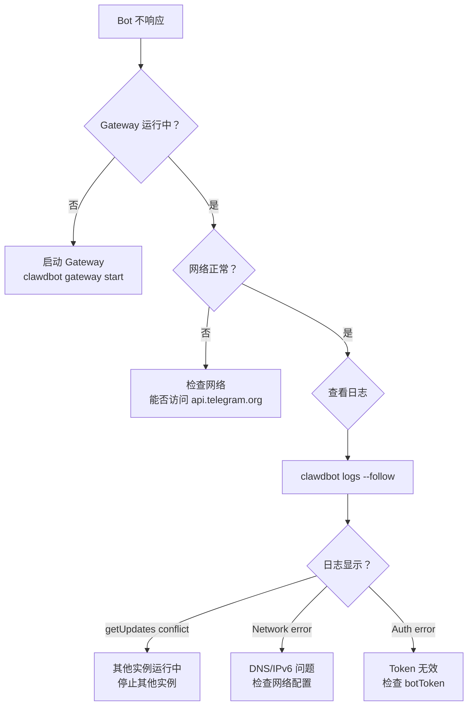

### Q6: 如何验证通信是否正常？

```bash
# 检查 Gateway 状态
clawdbot gateway status

# 查看实时日志
clawdbot logs --follow

# 手动测试 Telegram API
curl "https://api.telegram.org/bot<TOKEN>/getMe"
```

---

## 总结

| 场景 | 推荐模式 | 理由 |
|------|---------|------|
| 个人使用 | Long Polling | 零配置，开箱即用 |
| 内网部署 | Long Polling | 无需公网地址 |
| 高并发 | Webhook | 更好的性能 |
| 生产环境 | Webhook + CDN | 稳定可靠 |

对于大多数用户，**Long Polling 是最佳选择**——简单、可靠、无需额外配置。

---

## 参考链接

- [Telegram Bot API 官方文档](https://core.telegram.org/bots/api)
- [grammY 框架文档](https://grammy.dev/)
- [Clawdbot Telegram 配置](https://docs.clawd.bot/channels/telegram)
- [Tailscale Funnel 文档](https://tailscale.com/kb/1223/funnel)
