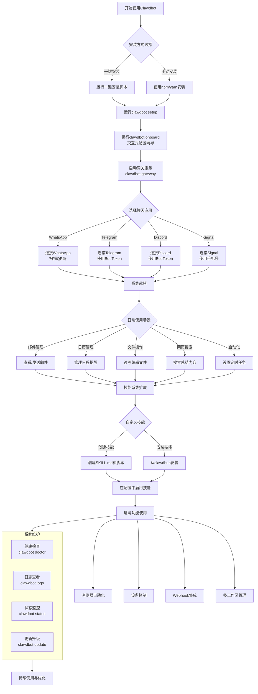
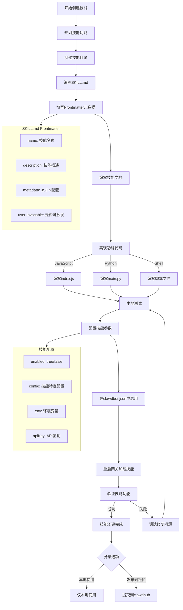
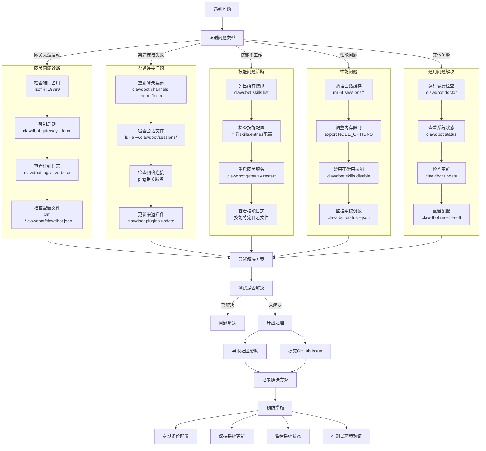

# Clawdbot 使用指南

> 🦞 Clawdbot — 你的个人AI助手，通过聊天应用自动化日常任务

## 目录
1. [什么是Clawdbot？](#什么是clawdbot)
2. [核心功能](#核心功能)
3. [安装与配置](#安装与配置)
4. [快速开始](#快速开始)
5. [核心命令详解](#核心命令详解)
6. [技能系统](#技能系统)
7. [使用示例](#使用示例)
8. [配置文件说明](#配置文件说明)
9. [故障排除](#故障排除)
10. [进阶使用](#进阶使用)

## 什么是Clawdbot？

Clawdbot是一个开源的个人AI助手平台，它允许你通过熟悉的聊天应用（如WhatsApp、Telegram、Discord等）来执行各种自动化任务。不同于传统的聊天机器人，Clawdbot更像是一个"数字管家"，可以访问你的本地文件、日历、邮件等，帮助你完成日常工作。

### 核心理念
- **隐私优先**：数据存储在本地，不依赖云服务
- **可扩展性**：通过技能系统无限扩展功能
- **跨平台**：支持多种聊天应用和操作系统
- **开发者友好**：易于创建和分享自定义技能

## 核心功能

### 📧 邮件管理
- 读取和整理收件箱
- 发送和回复邮件
- 邮件分类和过滤

### 📅 日历与提醒
- 查看和管理日历事件
- 设置提醒和定时任务
- 航班自动值机

### 🔍 信息检索
- 网页搜索和内容提取
- 文件系统搜索
- 记忆检索（长期/短期记忆）

### 📁 文件操作
- 文件读写和编辑
- 代码项目管理
- 文档处理

### ⏰ 自动化任务
- Cron定时任务调度
- 事件触发自动化
- 工作流编排

### 🛠️ 系统集成
- 浏览器自动化
- 终端命令执行
- 设备控制（摄像头、屏幕等）

## 安装与配置

### 系统要求
- macOS、Linux或Windows（通过WSL）
- Node.js 18+
- 稳定的网络连接

### 安装步骤

#### 1. 一键安装
```bash
curl -fsSL https://clawd.bot/install.sh | bash
```

#### 2. 手动安装（高级用户）
```bash
# 使用npm安装
npm install -g clawdbot

# 或使用yarn
yarn global add clawdbot
```

#### 3. 初始化配置
```bash
# 运行设置向导
clawdbot setup

# 或使用交互式向导
clawdbot onboard
```

### 配置向导
`clawdbot onboard` 会引导你完成：
1. **网关设置**：选择端口和网络配置
2. **工作区创建**：设置工作目录
3. **技能加载**：选择要启用的技能
4. **渠道连接**：配置聊天应用连接

## 快速开始

### 第一步：启动网关
```bash
# 启动网关服务
clawdbot gateway

# 指定端口（默认18789）
clawdbot gateway --port 18789
```

### 第二步：连接聊天应用
```bash
# 查看可用渠道
clawdbot channels

# 连接WhatsApp（显示QR码）
clawdbot channels login whatsapp

# 连接Telegram
clawdbot channels login telegram
```

### 第三步：开始对话
1. 在连接的聊天应用中向Clawdbot发送消息
2. 使用 `/help` 查看可用命令
3. 开始使用各种功能

## Clawdbot 完整使用流程图

以下是Clawdbot的完整使用流程，从安装到日常使用的各个阶段：



### 流程说明

#### 第一阶段：安装与初始化
1. **选择安装方式**：一键安装或手动安装
2. **运行设置向导**：配置基本参数和工作区
3. **交互式配置**：通过`clawdbot onboard`完成详细配置

#### 第二阶段：连接与启动
1. **启动网关**：运行`clawdbot gateway`启动服务
2. **连接渠道**：选择并连接你常用的聊天应用
3. **系统就绪**：完成所有配置，准备开始使用

#### 第三阶段：日常使用
- **邮件管理**：收发邮件、整理收件箱
- **日历管理**：查看日程、设置提醒
- **文件操作**：文档处理、代码管理
- **网页搜索**：信息检索、内容总结
- **自动化**：定时任务、工作流

#### 第四阶段：扩展与进阶
1. **技能系统**：使用内置技能或创建自定义技能
2. **高级功能**：浏览器自动化、设备控制等
3. **系统维护**：健康检查、日志监控、更新升级

#### 第五阶段：持续优化
- 根据使用习惯调整配置
- 添加新的技能和功能
- 优化性能和用户体验

## 核心命令详解

### 系统管理命令

| 命令 | 说明 | 常用选项 |
|------|------|----------|
| `clawdbot setup` | 初始化配置 | `--force` 强制重置 |
| `clawdbot onboard` | 交互式配置向导 | 无 |
| `clawdbot configure` | 配置管理 | `get/set/unset` |
| `clawdbot doctor` | 系统健康检查 | `--fix` 自动修复 |
| `clawdbot status` | 查看运行状态 | `--json` JSON格式输出 |

### 网关控制

| 命令 | 说明 | 常用选项 |
|------|------|----------|
| `clawdbot gateway` | 启动网关 | `--port` 指定端口 |
| `clawdbot logs` | 查看日志 | `--follow` 实时跟踪 |
| `clawdbot restart` | 重启服务 | `--delay` 延迟重启 |

### 消息与渠道

| 命令 | 说明 | 常用选项 |
|------|------|----------|
| `clawdbot channels` | 渠道管理 | `list/login/logout` |
| `clawdbot message send` | 发送消息 | `--to` 目标 `--message` 内容 |
| `clawdbot agent` | 与AI对话 | `--to` 发送到指定目标 |

### 技能管理

| 命令 | 说明 | 常用选项 |
|------|------|----------|
| `clawdbot skills` | 技能管理 | `list/enable/disable` |
| `clawdbot plugins` | 插件管理 | `install/remove/update` |

### 开发工具

| 命令 | 说明 | 常用选项 |
|------|------|----------|
| `clawdbot --dev` | 开发模式 | 隔离配置和端口 |
| `clawdbot sandbox` | 沙箱环境 | 安全测试环境 |
| `clawdbot tui` | 终端界面 | 交互式管理 |

## 技能系统

### 什么是技能？
技能是Clawdbot的功能扩展模块，每个技能都是一个独立的文件夹，包含：
- `SKILL.md`：技能定义和文档
- 脚本文件：执行具体功能的代码
- 配置文件：技能特定的设置

### 技能目录结构
```
技能名称/
├── SKILL.md          # 技能定义文件
├── index.js          # 主脚本文件
├── package.json      # 依赖配置
└── config/           # 配置文件目录
```

### 内置技能示例
1. **邮件管理**：收发邮件、整理收件箱
2. **日历集成**：事件管理、提醒设置
3. **文件操作**：文档处理、代码管理
4. **网页浏览**：搜索、内容提取
5. **天气查询**：天气预报、天气提醒

### 创建自定义技能



#### 1. 创建技能目录
```bash
mkdir -p ~/clawd/skills/my-custom-skill
```

#### 2. 编写SKILL.md
```markdown
---
name: my-custom-skill
description: 我的自定义技能
metadata: {"clawdbot":{"emoji":"🚀","requires":{"env":["API_KEY"]}}}
user-invocable: true
---

# 我的自定义技能

这是一个示例技能，用于演示如何创建Clawdbot技能。

## 功能
- 功能1：描述功能1
- 功能2：描述功能2

## 使用方法
使用 `/my-skill` 命令触发此技能。
```

#### 3. 添加执行脚本
创建 `index.js` 或其他脚本文件来实现功能。

#### 4. 启用技能
在配置文件中启用技能：
```json
{
  "skills": {
    "entries": {
      "my-custom-skill": {
        "enabled": true,
        "config": {
          "option1": "value1"
        }
      }
    }
  }
}
```

### 技能市场
访问 [clawdhub.com](https://clawdhub.com) 发现和安装社区技能：
```bash
# 安装技能
clawdhub install 技能名称

# 更新技能
clawdhub update --all
```

## 使用示例

### 示例1：通过WhatsApp管理邮件
```bash
# 1. 连接WhatsApp
clawdbot channels login whatsapp

# 2. 在WhatsApp中发送
# "查看我的未读邮件"
# "回复最新邮件：好的，收到"
```

### 示例2：设置日历提醒
```bash
# 通过Telegram设置提醒
# "明天下午3点提醒我开会"
# "查看本周的日程安排"
```

### 示例3：文件操作
```bash
# 通过Discord操作文件
# "列出当前目录的文件"
# "读取README.md文件"
# "创建新文档：项目计划"
```

### 示例4：网页搜索
```bash
# 搜索并总结网页内容
# "搜索最新的AI新闻"
# "总结这个网页的内容：https://example.com"
```

### 示例5：自动化工作流
```bash
# 设置定时任务
clawdbot cron add --schedule "0 9 * * *" --task "发送每日报告"

# 查看定时任务
clawdbot cron list
```

## 配置文件说明

### 主要配置文件
- **主配置**：`~/.clawdbot/clawdbot.json`
- **工作区配置**：`~/clawd/` 目录下的各种配置文件
- **会话数据**：`~/.clawdbot/agents/main/sessions/`

### 配置结构示例
```json
{
  "gateway": {
    "port": 18789,
    "host": "localhost"
  },
  "skills": {
    "load": {
      "extraDirs": ["/path/to/custom/skills"]
    },
    "entries": {
      "mail": {
        "enabled": true,
        "config": {
          "imap": {
            "host": "imap.gmail.com",
            "port": 993
          }
        }
      }
    }
  },
  "channels": {
    "whatsapp": {
      "enabled": true,
      "config": {
        "sessionPath": "~/.clawdbot/sessions/whatsapp"
      }
    }
  }
}
```

### 环境变量
```bash
# 设置API密钥
export CLAWDBOT_API_KEY="your-api-key"

# 设置开发模式
export CLAWDBOT_DEV=true
```

## 故障排除

### 常见问题

#### 1. 网关启动失败
```bash
# 检查端口占用
lsof -i :18789

# 强制启动（释放端口）
clawdbot gateway --force

# 查看详细日志
clawdbot logs --verbose
```

#### 2. 渠道连接问题
```bash
# 重新登录
clawdbot channels logout whatsapp
clawdbot channels login whatsapp

# 检查会话文件
ls -la ~/.clawdbot/sessions/
```

#### 3. 技能加载失败
```bash
# 检查技能配置
clawdbot skills list

# 重新加载技能
clawdbot gateway restart
```

#### 4. 内存不足
```bash
# 清理会话缓存
rm -rf ~/.clawdbot/agents/main/sessions/*

# 调整内存限制
export NODE_OPTIONS="--max-old-space-size=4096"
```

### 诊断工具
```bash
# 运行健康检查
clawdbot doctor

# 查看系统状态
clawdbot status --json

# 测试网络连接
clawdbot doctor --network
```

### 故障排除流程图



## 进阶使用

### 多工作区管理
```bash
# 创建新工作区
mkdir ~/clawd-work
cd ~/clawd-work
clawdbot setup

# 使用特定工作区
clawdbot --workspace ~/clawd-work gateway
```

### 自定义模型配置
```json
{
  "agent": {
    "model": "openai/gpt-4",
    "apiKey": "your-openai-key",
    "temperature": 0.7
  }
}
```

### 浏览器自动化
```bash
# 控制浏览器
clawdbot browser open https://example.com
clawdbot browser screenshot --output page.png
```

### 设备集成
```bash
# 摄像头拍照
clawdbot nodes camera_snap --facing front

# 屏幕录制
clawdbot nodes screen_record --duration 10s

# 发送通知
clawdbot nodes notify --title "提醒" --body "时间到了"
```

### Webhook集成
```bash
# 设置webhook接收器
clawdbot webhooks add --name "github" --url "http://localhost:18789/webhook/github"

# 查看webhook
clawdbot webhooks list
```

## 最佳实践

### 安全建议
1. **定期备份配置**：备份 `~/.clawdbot/` 目录
2. **使用环境变量**：避免在配置文件中存储敏感信息
3. **限制访问权限**：仅允许可信设备连接
4. **定期更新**：保持Clawdbot和技能最新版本

### 性能优化
1. **合理使用记忆**：定期清理不必要的会话数据
2. **技能懒加载**：仅启用需要的技能
3. **缓存配置**：对频繁访问的数据使用缓存
4. **监控资源**：使用 `clawdbot status` 监控系统状态

### 开发建议
1. **使用开发模式**：测试时使用 `--dev` 标志
2. **版本控制**：对自定义技能使用Git管理
3. **模块化设计**：保持技能功能单一和可复用
4. **充分测试**：在沙箱环境中测试新功能

## 获取帮助

### 官方资源
- **文档**：[docs.clawd.bot](https://docs.clawd.bot)
- **GitHub**：[github.com/clawdbot/clawdbot](https://github.com/clawdbot/clawdbot)
- **社区**：[Discord社区](https://discord.com/invite/clawd)

### 支持渠道
```bash
# 查看帮助
clawdbot --help
clawdbot <command> --help

# 查看版本信息
clawdbot --version

# 打开控制面板
clawdbot dashboard
```

### 问题反馈
1. 查看现有问题：[GitHub Issues](https://github.com/clawdbot/clawdbot/issues)
2. 提交新问题：包含日志和复现步骤
3. 社区讨论：在Discord中寻求帮助

---

## 更新日志

### 版本 2026.1.24-3
- 新增：增强的技能管理系统
- 改进：更稳定的网关连接
- 修复：多个渠道连接问题
- 优化：内存使用和性能

### 版本 2026.1.20-1
- 新增：浏览器自动化功能
- 新增：设备控制API
- 改进：技能加载机制
- 修复：配置文件验证问题

---

*最后更新：2026年1月26日*

> 提示：Clawdbot正在快速发展，建议定期查看官方文档获取最新信息。