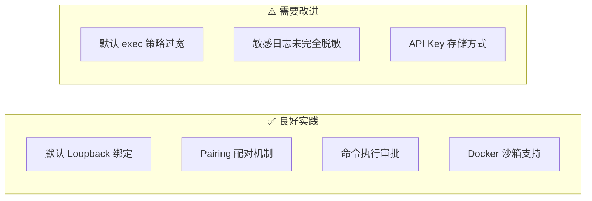
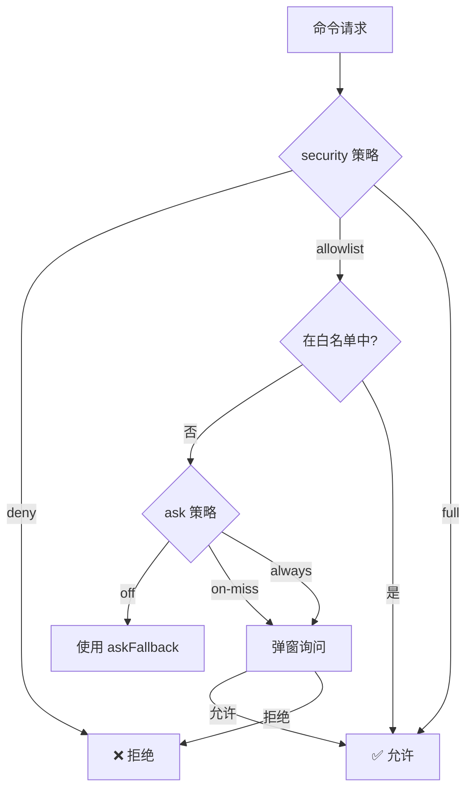
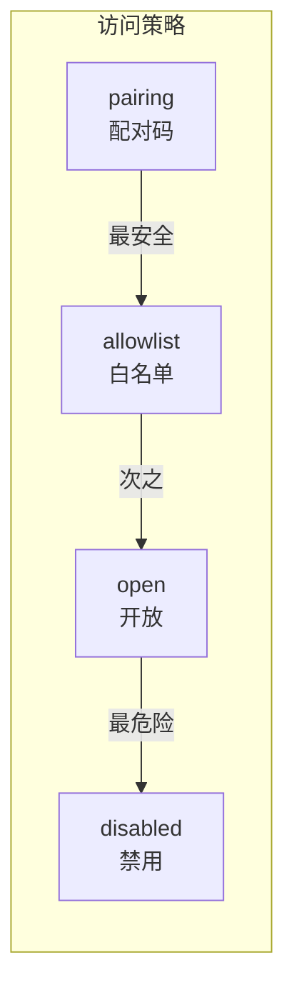
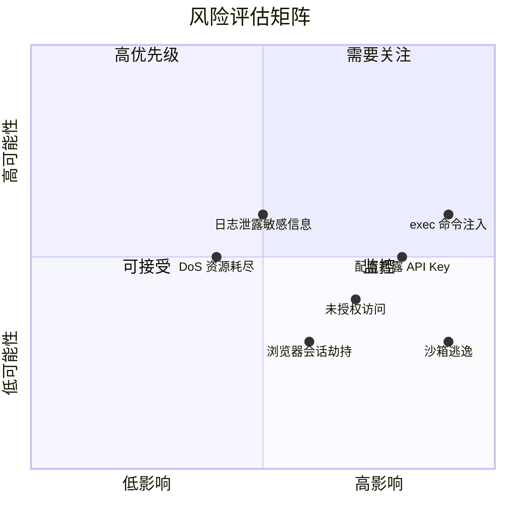
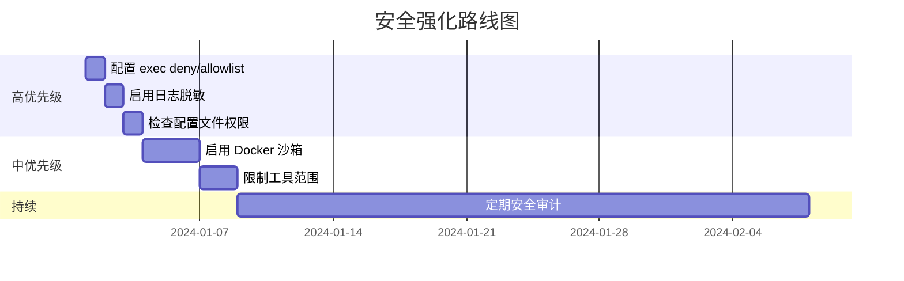

# Clawdbot 安全评估报告

> 本报告基于 Clawdbot 源代码分析，评估其安全机制、潜在风险及强化建议。

---

## 目录

1. [执行摘要](#执行摘要)
2. [现有安全机制分析](#现有安全机制分析)
3. [风险评估矩阵](#风险评估矩阵)
4. [高风险点详细分析](#高风险点详细分析)
5. [安全强化建议](#安全强化建议)
6. [安全配置检查清单](#安全配置检查清单)

---

## 执行摘要

### 总体评价

Clawdbot 作为一个 AI Agent，具有以下核心能力，这些能力同时也是安全风险点：

| 能力 | 风险等级 | 现有防护 |
|------|---------|---------|
| 命令执行 (exec) | 🔴 高 | 审批系统 + 白名单 |
| 文件读写 (read/write) | 🔴 高 | 沙箱隔离 |
| 浏览器控制 (browser) | 🟡 中 | Token 认证 |
| 网络请求 (web_fetch) | 🟡 中 | 无特殊限制 |
| 消息发送 (message) | 🟢 低 | 访问控制 |

### 安全设计原则评估



---

## 现有安全机制分析

### 1. 命令执行审批系统 (Exec Approvals)

**位置**: `~/.clawdbot/exec-approvals.json`



**三级安全策略**:

| 策略 | 说明 | 默认值 |
|------|------|--------|
| `deny` | 拒绝所有主机命令执行 | ✅ 默认 |
| `allowlist` | 仅允许白名单命令 | - |
| `full` | 允许所有命令（危险） | - |

**询问策略**:

| 策略 | 说明 |
|------|------|
| `off` | 不询问，直接用 fallback |
| `on-miss` | 白名单未命中时询问 |
| `always` | 每次都询问 |

**代码实现分析**:

```typescript
// 来自 exec-approvals.ts
const DEFAULT_SECURITY: ExecSecurity = "deny";      // ✅ 默认拒绝
const DEFAULT_ASK: ExecAsk = "on-miss";             // ✅ 未命中询问
const DEFAULT_ASK_FALLBACK: ExecSecurity = "deny";  // ✅ 回退拒绝
const DEFAULT_AUTO_ALLOW_SKILLS = false;            // ✅ 技能命令不自动允许
```

**安全亮点**:
- ✅ 默认 `deny`，需要显式开启
- ✅ 支持 glob 模式白名单
- ✅ 配置文件权限 `0o600`
- ✅ 记录命令使用历史

**潜在风险**:
- ⚠️ `full` 模式绕过所有检查
- ⚠️ 白名单支持通配符，可能过于宽泛
- ⚠️ 危险命令（如 `rm -rf`）无特殊阻止

### 2. Docker 沙箱机制

**配置位置**: `sandbox.docker.*`

```mermaid
flowchart TB
    subgraph 沙箱容器["🐳 Docker 沙箱"]
        WS[/workspace 挂载]
        AGENT[Agent 代码]
        TOOLS[受限工具]
    end
    
    subgraph 主机["🖥️ 主机系统"]
        HOST_FS[主机文件系统]
        HOST_NET[主机网络]
        HOST_PROC[主机进程]
    end
    
    WS -.->|只读/读写| HOST_FS
    TOOLS -.->|需要 elevated| HOST_NET
    TOOLS -.->|需要 elevated| HOST_PROC
```

**支持的安全配置**:

| 配置项 | 说明 | 安全作用 |
|--------|------|---------|
| `readOnlyRoot` | 只读根文件系统 | 防止持久化恶意代码 |
| `network: "none"` | 禁用网络 | 防止数据泄露 |
| `capDrop` | 丢弃 Linux 能力 | 最小权限 |
| `pidsLimit` | 限制进程数 | 防止 fork 炸弹 |
| `memory` | 内存限制 | 防止资源耗尽 |
| `seccompProfile` | Seccomp 配置 | 系统调用过滤 |
| `apparmorProfile` | AppArmor 配置 | 强制访问控制 |

**代码示例** (来自 `types.sandbox.ts`):

```typescript
export type SandboxDockerSettings = {
  image?: string;
  readOnlyRoot?: boolean;        // 只读根文件系统
  network?: string;              // bridge|none|custom
  capDrop?: string[];            // 丢弃的能力
  pidsLimit?: number;            // 进程数限制
  memory?: string | number;      // 内存限制
  seccompProfile?: string;       // Seccomp 配置
  apparmorProfile?: string;      // AppArmor 配置
};
```

**安全亮点**:
- ✅ 支持多层隔离配置
- ✅ 可配置资源限制
- ✅ 支持安全配置文件

**潜在风险**:
- ⚠️ 默认未启用沙箱
- ⚠️ workspace 挂载可能泄露敏感文件
- ⚠️ 沙箱逃逸风险（Docker 漏洞）

### 3. 访问控制机制



**DM 策略** (`dmPolicy`):

| 策略 | 安全级别 | 说明 |
|------|---------|------|
| `pairing` | 🟢 高 | 需要配对码验证（默认） |
| `allowlist` | 🟡 中 | 需要在白名单中 |
| `open` | 🔴 低 | 任何人可访问 |
| `disabled` | - | 禁用 DM |

**群组策略** (`groupPolicy`):

| 策略 | 说明 |
|------|------|
| `allowlist` | 仅白名单群组 |
| `open` | 任何群组（危险） |
| `disabled` | 禁用群组 |

### 4. 内置安全审计

**命令**: `clawdbot security audit`

审计检查项（来自 `security/audit.ts`）:

| 检查 ID | 严重性 | 说明 |
|---------|--------|------|
| `gateway.bind_no_auth` | 🔴 Critical | 非 loopback 绑定无认证 |
| `gateway.tailscale_funnel` | 🔴 Critical | Funnel 暴露到公网 |
| `channels.*.dm.open` | 🔴 Critical | DM 完全开放 |
| `fs.config.perms_writable` | 🔴 Critical | 配置文件可被他人写入 |
| `fs.state_dir.perms_world_writable` | 🔴 Critical | 状态目录世界可写 |
| `tools.elevated.allowFrom.*.wildcard` | 🔴 Critical | 提权白名单包含通配符 |
| `logging.redact_off` | 🟡 Warn | 日志脱敏关闭 |
| `browser.control_remote_no_token` | 🔴 Critical | 远程浏览器控制无 Token |

### 5. 工具策略 (Tool Policy)

**可配置项**:

```json5
{
  "tools": {
    "allow": ["exec", "read", "write"],  // 允许的工具
    "deny": ["gateway", "sessions_*"],    // 拒绝的工具
    "profile": "default"                  // 工具配置文件
  }
}
```

**子 Agent 默认拒绝工具** (来自 `pi-tools.policy.ts`):

```typescript
const DEFAULT_SUBAGENT_TOOL_DENY = [
  "sessions_list",      // 会话管理
  "sessions_history",
  "sessions_send",
  "sessions_spawn",
  "gateway",            // 系统管理（危险）
  "agents_list",
  "whatsapp_login",     // 交互式设置
  "session_status",
  "cron",
  "memory_search",      // 内存访问
  "memory_get",
];
```

---

## 风险评估矩阵



### 风险详细评级

| 风险 | 可能性 | 影响 | 综合评级 | 现有缓解 |
|------|--------|------|----------|---------|
| 恶意命令执行 | 高 | 严重 | 🔴 高 | 审批系统 |
| API Key 泄露 | 中 | 严重 | 🔴 高 | 配置文件权限 |
| 未授权访问 | 中 | 高 | 🟡 中 | Pairing 机制 |
| 沙箱逃逸 | 低 | 严重 | 🟡 中 | Docker 隔离 |
| 日志敏感信息 | 高 | 中 | 🟡 中 | 脱敏选项 |
| 资源耗尽 | 中 | 中 | 🟢 低 | 资源限制 |

---

## 高风险点详细分析

### 1. 🔴 exec 工具 - 命令注入风险

**问题描述**:

exec 工具允许 AI Agent 执行任意 shell 命令，如果：
- LLM 被提示词注入（Prompt Injection）
- 用户输入被拼接到命令中
- 白名单配置过于宽泛

可能导致：
- 数据删除 (`rm -rf`)
- 敏感信息泄露
- 系统被控制

**代码分析**:

```typescript
// 来自 exec-approvals.ts
// 危险：支持通配符可能过于宽泛
function globToRegExp(pattern: string): RegExp {
  // 支持 * 和 ** 通配符
  // 例如 /usr/bin/* 会匹配所有程序
}

// 危险：链式命令支持
function splitCommandChain(command: string): string[] | null {
  // 支持 &&, ||, ; 操作符
  // 例如 "safe-cmd && rm -rf /"
}
```

**攻击场景**:

```mermaid
sequenceDiagram
    participant USER as 恶意用户
    participant BOT as Clawdbot
    participant EXEC as exec 工具
    participant HOST as 主机系统

    USER->>BOT: "帮我运行: echo hello; rm -rf ~"
    BOT->>BOT: LLM 解析命令
    BOT->>EXEC: exec("echo hello; rm -rf ~")
    
    alt 白名单配置为 /bin/*
        EXEC->>HOST: 执行命令
        HOST->>HOST: 删除用户目录 ❌
    else 默认 deny
        EXEC-->>BOT: 拒绝执行 ✅
    end
```

### 2. 🔴 配置文件安全

**问题描述**:

`~/.clawdbot/clawdbot.json` 可能包含：
- API Keys（OpenAI, Anthropic, DeepSeek 等）
- Bot Tokens（Telegram, Discord 等）
- 认证凭据

**风险点**:

```json5
// 危险：明文存储敏感信息
{
  "models": {
    "providers": {
      "deepseek": {
        "baseUrl": "https://api.deepseek.com",
        "apiKey": "sk-xxxxxxxxxxxxx"  // ⚠️ 明文 API Key
      }
    }
  },
  "channels": {
    "telegram": {
      "botToken": "123456:ABC..."     // ⚠️ 明文 Bot Token
    }
  }
}
```

**代码中的保护措施**:

```typescript
// 来自 security/audit.ts
// ✅ 检查配置文件权限
if (isWorldReadable(bits)) {
  findings.push({
    checkId: "fs.config.perms_world_readable",
    severity: "critical",
    title: "Config file is world-readable",
    remediation: `chmod 600 ${params.configPath}`,
  });
}
```

### 3. 🔴 Elevated 模式风险

**问题描述**:

`/elevated full` 模式会：
- 绕过所有 exec 审批
- 在主机直接执行命令
- 无白名单限制

**配置路径**:

```
用户 → /elevated full → AI Agent → exec 工具 → 主机系统
                                        ↓
                              跳过所有安全检查 ⚠️
```

### 4. 🟡 浏览器控制风险

**问题描述**:

browser 工具可以：
- 控制真实浏览器
- 访问用户登录状态
- 截取屏幕内容

**代码分析** (来自 `security/audit.ts`):

```typescript
// 远程浏览器控制检查
if (!isLoopback) {
  if (!controlToken) {
    findings.push({
      checkId: "browser.control_remote_no_token",
      severity: "critical",
      title: "Remote browser control is missing an auth token",
    });
  }
}
```

### 5. 🟡 Long Polling 网络风险

**问题描述**:

虽然 Long Polling 不需要公网地址，但：
- 出站流量可被监听（如果不是 HTTPS）
- Bot Token 在请求中传输
- 中间人可能篡改响应

**缓解措施**:
- ✅ Telegram API 使用 HTTPS
- ⚠️ 无证书固定（Certificate Pinning）

---

## 安全强化建议

### 优先级 1：高危风险缓解

#### 1.1 强化 exec 审批

**当前状态**: 默认 `deny`，但可配置为 `full`

**建议**:

```json5
// 推荐配置
{
  "tools": {
    "exec": {
      "security": "allowlist",  // 永远使用白名单
      "ask": "always",          // 每次都询问
      "askFallback": "deny"     // 无法询问时拒绝
    }
  }
}
```

**代码层面建议**:
- 添加危险命令黑名单（`rm -rf`, `dd`, `mkfs` 等）
- 限制可执行的路径范围
- 实现命令参数验证

#### 1.2 敏感信息保护

**建议**:

```bash
# 1. 使用环境变量而非配置文件存储密钥
export OPENAI_API_KEY="sk-..."
export TELEGRAM_BOT_TOKEN="123:ABC..."

# 2. 确保配置文件权限
chmod 600 ~/.clawdbot/clawdbot.json
chmod 700 ~/.clawdbot/

# 3. 定期轮换密钥
```

**代码层面建议**:
- 实现密钥轮换提醒
- 支持外部密钥管理（如 macOS Keychain）
- 加密存储敏感配置

#### 1.3 禁用危险配置

**建议**:

```json5
{
  "tools": {
    "elevated": {
      "enabled": false,        // 禁用提权
      // 或限制白名单
      "allowFrom": {
        "telegram": ["你的用户ID"]
      }
    }
  },
  "commands": {
    "bash": false,             // 禁用直接 bash
    "config": false            // 禁用配置修改
  }
}
```

### 优先级 2：强化隔离

#### 2.1 启用 Docker 沙箱

**推荐配置**:

```json5
{
  "sandbox": {
    "enabled": true,
    "docker": {
      "readOnlyRoot": true,     // 只读根文件系统
      "network": "none",        // 禁用网络（按需开启）
      "capDrop": ["ALL"],       // 丢弃所有能力
      "pidsLimit": 50,          // 限制进程数
      "memory": "512m",         // 限制内存
      "user": "1000:1000"       // 非 root 用户
    }
  }
}
```

#### 2.2 限制工具范围

**按需启用工具**:

```json5
{
  "tools": {
    "allow": [
      "read",           // 读取文件
      "write",          // 写入文件
      "web_search",     // 网络搜索
      "message"         // 发送消息
    ],
    "deny": [
      "exec",           // 禁用命令执行
      "browser_*",      // 禁用浏览器
      "gateway",        // 禁用网关控制
      "sessions_*"      // 禁用会话管理
    ]
  }
}
```

### 优先级 3：监控与审计

#### 3.1 启用完整日志

```json5
{
  "logging": {
    "redactSensitive": "tools",  // 脱敏工具输出
    "level": "info",
    "auditExec": true            // 记录所有 exec
  }
}
```

#### 3.2 定期安全审计

```bash
# 运行内置安全审计
clawdbot security audit --deep

# 检查配置权限
ls -la ~/.clawdbot/

# 检查运行状态
clawdbot gateway status
```

---

## 安全配置检查清单

### 基础配置检查

- [ ] Gateway 绑定 `loopback`
- [ ] 配置文件权限 `600`
- [ ] 状态目录权限 `700`
- [ ] DM 策略为 `pairing` 或 `allowlist`
- [ ] 群组策略非 `open`

### exec 工具检查

- [ ] `security` 设置为 `deny` 或 `allowlist`
- [ ] `ask` 设置为 `on-miss` 或 `always`
- [ ] 白名单不包含危险命令
- [ ] 白名单不使用过于宽泛的通配符
- [ ] `elevated` 已禁用或严格限制

### 敏感信息检查

- [ ] API Key 使用环境变量
- [ ] Bot Token 使用环境变量
- [ ] 日志脱敏已启用
- [ ] 配置文件不在版本控制中

### 网络安全检查

- [ ] 非 loopback 绑定有认证
- [ ] Tailscale Funnel 未启用（除非必要）
- [ ] 浏览器控制有 Token
- [ ] 远程服务使用 HTTPS

### 运行时检查

```bash
# 1. 运行安全审计
clawdbot security audit --deep

# 2. 检查进程权限
ps aux | grep clawdbot

# 3. 检查网络监听
netstat -an | grep 18789

# 4. 检查日志异常
clawdbot logs --follow
```

---

## 总结

### 安全亮点

1. ✅ **默认安全** - exec 默认 deny，Gateway 默认 loopback
2. ✅ **多层防护** - 审批系统 + 沙箱 + 访问控制
3. ✅ **内置审计** - `clawdbot security audit`
4. ✅ **配对机制** - 防止未授权访问

### 需要改进

1. ⚠️ **密钥管理** - 建议支持外部密钥管理
2. ⚠️ **命令黑名单** - 建议添加危险命令硬编码拒绝
3. ⚠️ **默认沙箱** - 建议默认启用 Docker 沙箱
4. ⚠️ **证书固定** - 建议对关键 API 启用证书固定

### 风险缓解优先级



---

## 参考资料

- [Clawdbot Exec Approvals 文档](https://docs.clawd.bot/tools/exec-approvals)
- [Clawdbot Elevated 模式文档](https://docs.clawd.bot/tools/elevated)
- [Docker 安全最佳实践](https://docs.docker.com/engine/security/)
- [OWASP AI 安全指南](https://owasp.org/www-project-ai-security/)
