# Clawdbot 系统架构设计文档

> 🦞 Clawdbot — 个人 AI 助手系统架构分析

## 目录

- [系统概述](#系统概述)
- [核心架构](#核心架构)
- [数据流程](#数据流程)
- [核心组件详解](#核心组件详解)
- [消息处理流程](#消息处理流程)
- [Agent 运行机制](#agent-运行机制)
- [技术栈](#技术栈)

---

## 系统概述

Clawdbot 是一个**本地优先**的个人 AI 助手系统，采用 Gateway 作为核心控制平面，支持多渠道消息接入和多工具调用。

### 核心特点

- **本地运行**：Gateway 运行在用户设备上，数据不经过第三方服务器
- **多渠道支持**：WhatsApp、Telegram、Discord、Slack 等 10+ 渠道
- **多模型支持**：Anthropic、OpenAI、DeepSeek、Gemini 等
- **工具调用**：文件操作、命令执行、浏览器控制、定时任务等
- **多代理协作**：支持多个隔离的 Agent 实例

---

## 核心架构

### 整体架构图

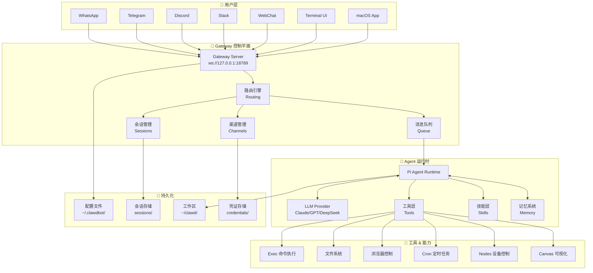

### 分层架构

```mermaid
graph LR
    subgraph L1["接入层"]
        A1[消息渠道适配器]
        A2[WebSocket API]
        A3[HTTP API]
    end

    subgraph L2["控制层"]
        B1[Gateway 服务]
        B2[路由 & 分发]
        B3[认证 & 授权]
    end

    subgraph L3["业务层"]
        C1[Agent 运行时]
        C2[会话管理]
        C3[工具调度]
    end

    subgraph L4["能力层"]
        D1[LLM 调用]
        D2[工具执行]
        D3[技能加载]
    end

    subgraph L5["存储层"]
        E1[配置存储]
        E2[会话持久化]
        E3[凭证管理]
    end

    L1 --> L2 --> L3 --> L4 --> L5
```

---

## 数据流程

### 消息处理完整流程

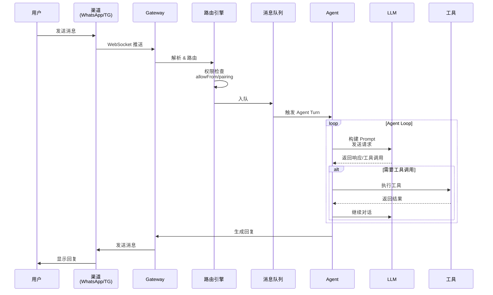

### 多渠道路由机制

```mermaid
flowchart TD
    MSG[收到消息] --> PARSE[解析消息来源]
    PARSE --> CHECK{权限检查}
    
    CHECK -->|未授权| PAIR[发送配对码]
    CHECK -->|已授权| ROUTE[路由决策]
    
    ROUTE --> TYPE{消息类型}
    TYPE -->|私聊 DM| DM_SESS[个人会话]
    TYPE -->|群聊 Group| GRP_CHECK{@提及检查}
    
    GRP_CHECK -->|需要@| MENTION{是否@机器人}
    GRP_CHECK -->|不需要| GRP_SESS[群组会话]
    
    MENTION -->|是| GRP_SESS
    MENTION -->|否| IGNORE[忽略]
    
    DM_SESS --> QUEUE[消息队列]
    GRP_SESS --> QUEUE
    
    QUEUE --> AGENT[Agent 处理]
    
    style MSG fill:#e1f5fe
    style AGENT fill:#c8e6c9
    style IGNORE fill:#ffcdd2
```

---

## 核心组件详解

### 1. Gateway 服务

Gateway 是整个系统的**控制平面**，负责：

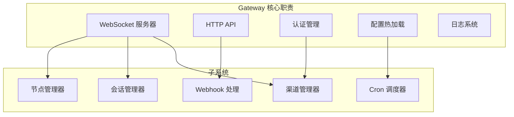

**关键配置**：
```json
{
  "gateway": {
    "mode": "local",
    "port": 18789,
    "bind": "loopback",
    "auth": { "mode": "token" }
  }
}
```

### 2. Agent 运行时

Agent 是核心的 AI 推理引擎：

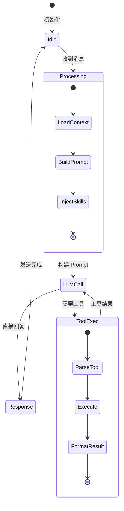

**Agent Loop 流程**：

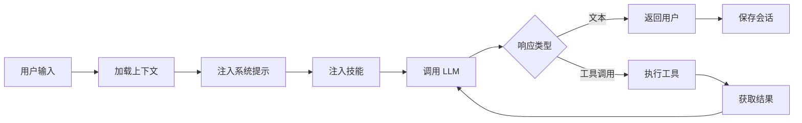

### 3. 渠道适配器

每个消息渠道都有独立的适配器：

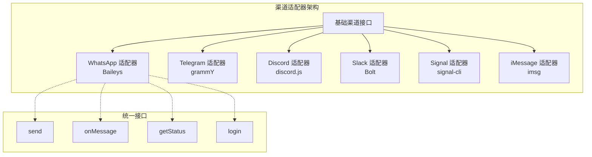

### 4. 工具系统

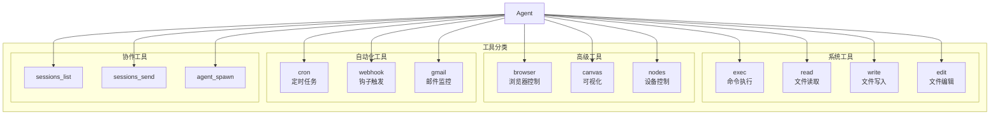

### 5. 技能系统 (Skills)

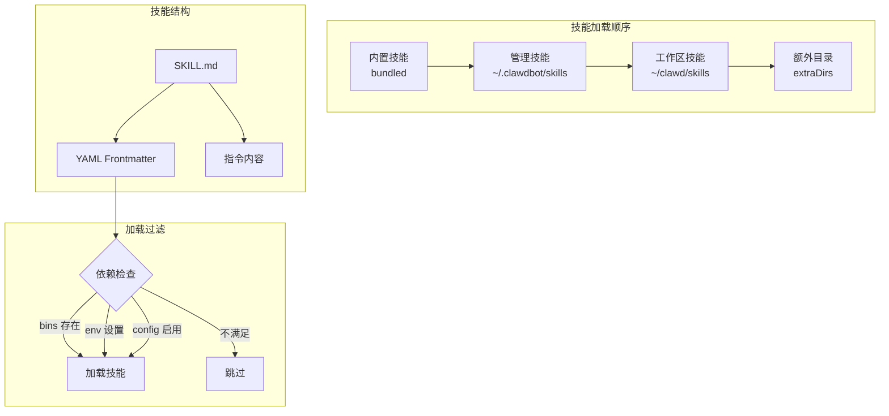

---

## 消息处理流程

### 完整消息生命周期

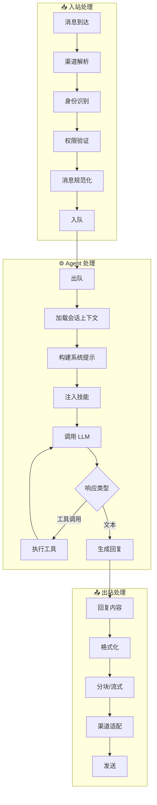

### 队列模式

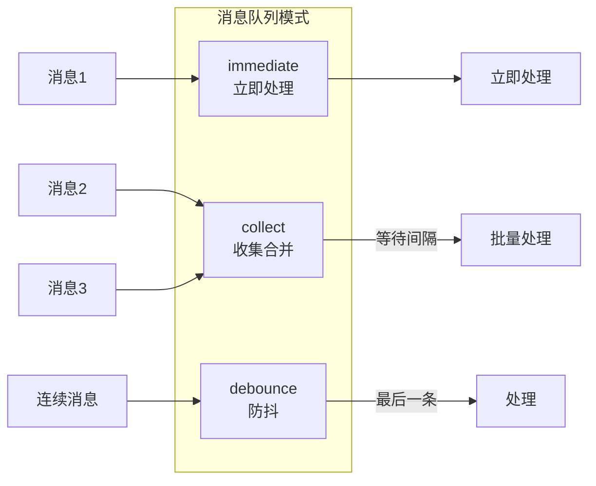

---

## Agent 运行机制

### Agent 配置架构

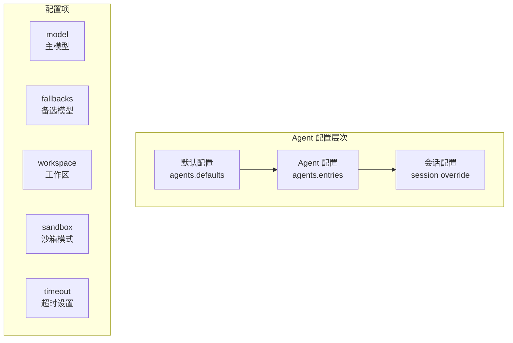

### 多 Agent 隔离

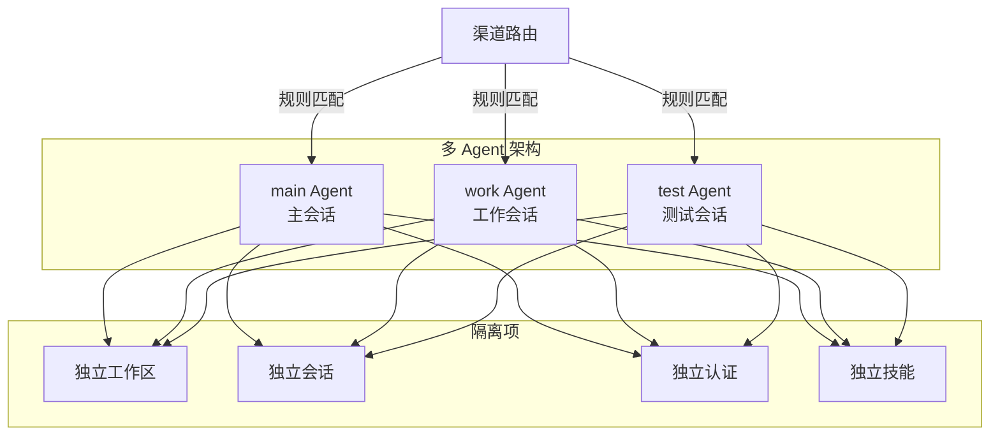

### 会话管理

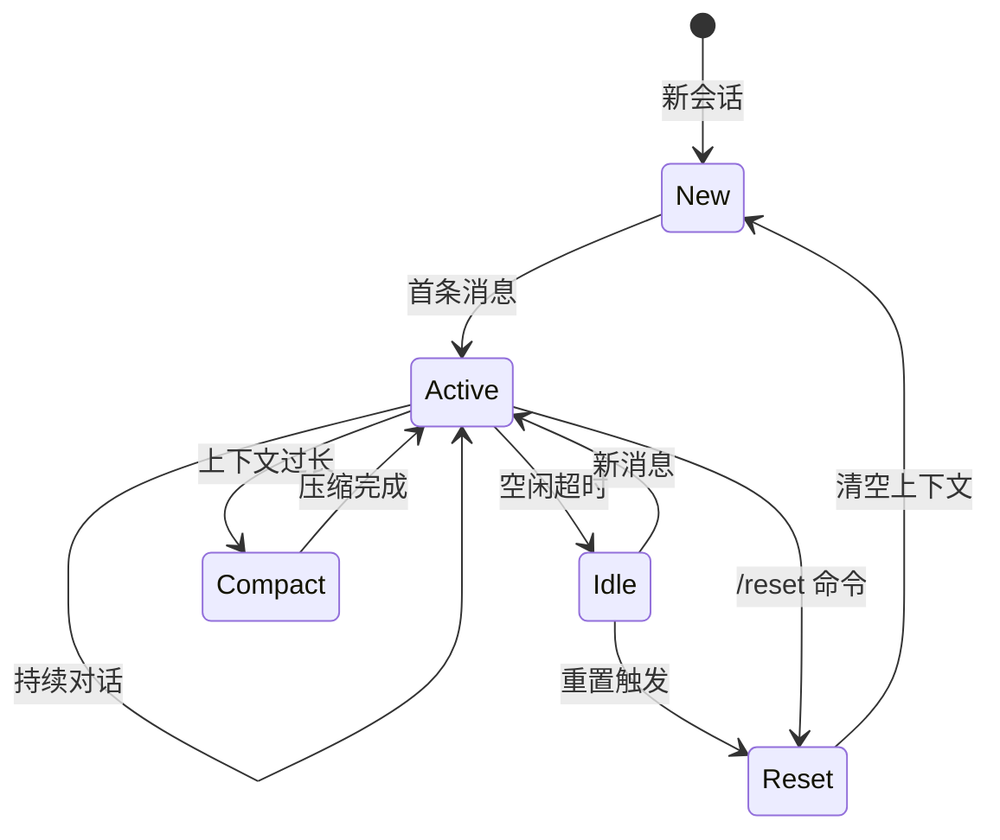

---

## 技术栈

### 核心技术

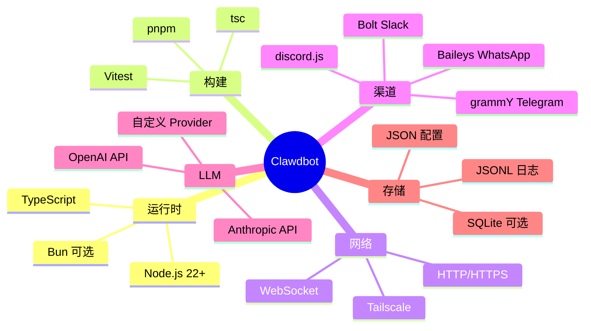

### 目录结构

```
clawdbot/
├── src/                    # 核心源码
│   ├── gateway/           # Gateway 服务
│   ├── agents/            # Agent 运行时
│   ├── channels/          # 渠道适配器
│   ├── cli/               # CLI 命令
│   ├── commands/          # 命令处理
│   ├── config/            # 配置管理
│   ├── cron/              # 定时任务
│   ├── browser/           # 浏览器控制
│   ├── memory/            # 记忆系统
│   ├── hooks/             # Webhook
│   ├── telegram/          # Telegram 适配
│   ├── discord/           # Discord 适配
│   ├── slack/             # Slack 适配
│   └── ...
├── apps/                   # 原生应用
│   ├── macos/             # macOS 菜单栏应用
│   ├── ios/               # iOS 节点应用
│   └── android/           # Android 节点应用
├── extensions/            # 扩展插件
├── skills/                # 内置技能
├── docs/                  # 文档
└── ui/                    # Web UI
```

---

## 安全模型

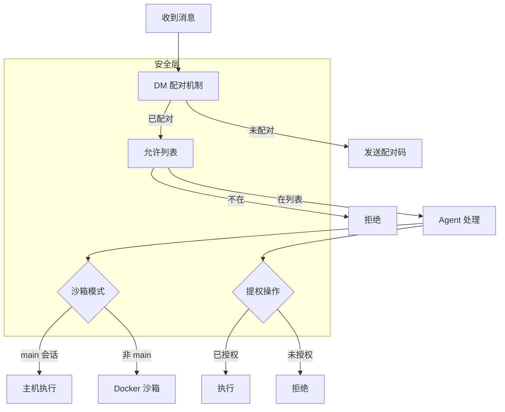

---

## 部署架构

### 本地部署

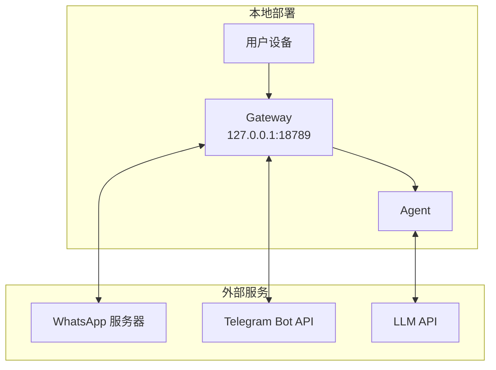

### 远程部署

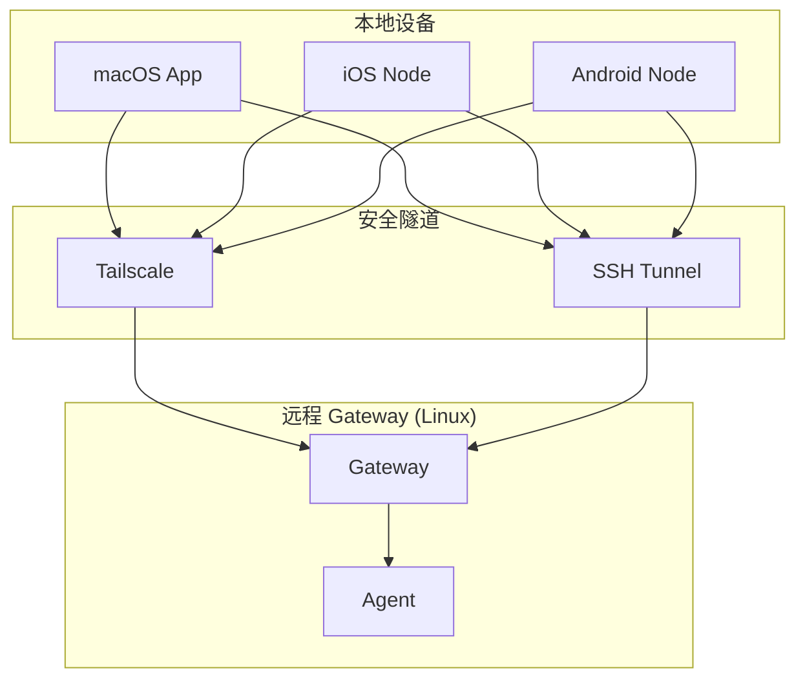

---

## 总结

Clawdbot 采用**本地优先、Gateway 中心化**的架构设计：

1. **Gateway** 作为统一控制平面，管理所有渠道连接和消息路由
2. **Agent** 作为 AI 推理引擎，处理对话和工具调用
3. **多渠道适配器** 统一接口，支持 10+ 消息平台
4. **技能系统** 提供可扩展的能力增强
5. **安全模型** 通过配对、允许列表、沙箱实现多层防护

这种架构使得 Clawdbot 既能保持本地数据隐私，又能灵活扩展和部署。
