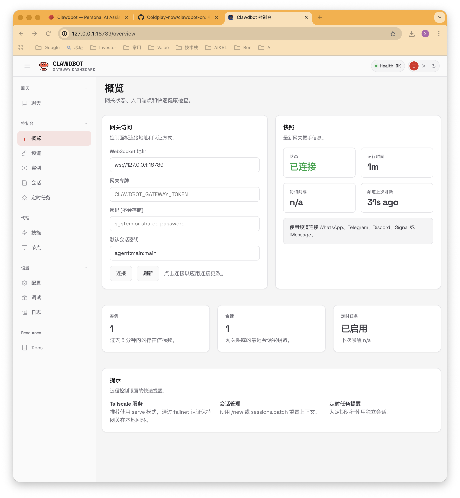
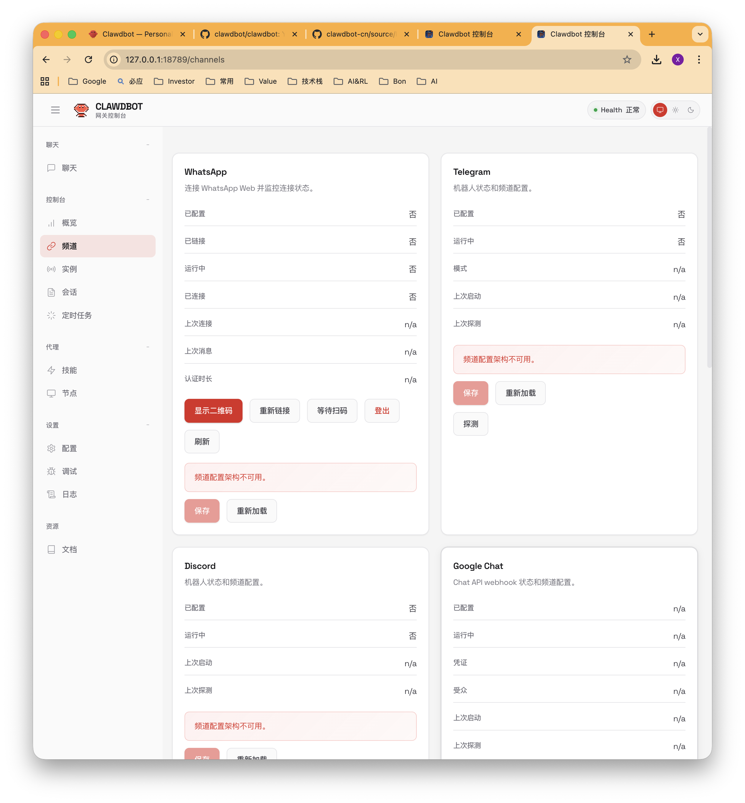
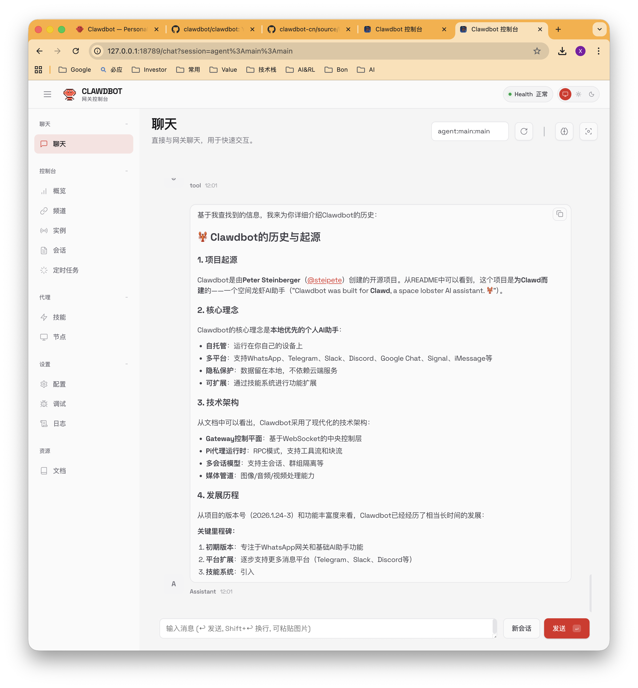

# Moltbot 中文汉化版 🇨🇳

> 🦞 **Moltbot**（原 Clawdbot）— 个人 AI 助手，通过聊天应用自动化你的日常任务

[](https://molt.bot)
[](https://github.com/moltbot/moltbot)
[](https://docs.molt.bot)
[](LICENSE)
[](https://cursor.sh)
[](https://anthropic.com)

---

## 📢 项目更名通知

> **重要**: 原项目 **Clawdbot** 已由作者 [@steipete](https://twitter.com/steipete) 更名为 **Moltbot**！
> 
> - 🌐 新官网: https://molt.bot
> - 📖 新文档: https://docs.molt.bot  
> - 🐙 新仓库: https://github.com/moltbot/moltbot
>
> 本汉化版已同步更新相关链接。CLI 命令仍为 `clawdbot`。

---

## ✨ 这是什么？

这是 [Moltbot](https://github.com/moltbot/moltbot) 的 **中文汉化版本**，包含：

- 🌐 **Web UI 完整汉化** - 控制台界面全部中文化
- 📖 **中文使用文档** - 详细的使用指南和技术文档
- 🔒 **安全加固指南** - 新手安全配置教程
- 🔧 **示例技能** - 开箱即用的中文技能模板
- 📊 **架构分析文档** - 深入的技术实现分析

### 控制台概览



### 频道管理



### AI 聊天



---

## 🔗 项目链接

| 资源 | 链接 |
|------|------|
| **官方网站** | https://molt.bot |
| **GitHub 仓库** | https://github.com/moltbot/moltbot |
| **官方文档** | https://docs.molt.bot |
| **技能市场** | https://clawdhub.com |

---

## 📦 安装

```bash
curl -fsSL https://molt.bot/install.sh | bash
```

安装完成后运行初始设置：

```bash
clawdbot onboard
```

### 使用汉化版 Web UI

将本仓库的汉化 UI 部署到本地：

```bash
# 克隆本仓库
git clone https://github.com/Coldplay-now/clawdbot-cn.git
cd clawdbot-cn/source/ui

# 安装依赖并构建
pnpm install
pnpm build

# 复制到全局安装目录
cp -r ../dist/control-ui/* $(npm root -g)/clawdbot/dist/control-ui/

# 重启网关
clawdbot gateway restart
```

访问 http://127.0.0.1:18789 即可看到中文界面。

---

## 🚀 快速开始

### 1. 完整配置向导

```bash
clawdbot onboard
```

### 2. 启动网关服务

```bash
clawdbot gateway
```

### 3. 打开控制面板

```bash
clawdbot dashboard
```

---

## 📚 中文文档

本仓库包含以下中文文档：

| 文档 | 说明 |
|------|------|
| [Moltbot新手安全指引.md](Moltbot新手安全指引.md) | 🔒 **新手必读** - 安全配置教程 |
| [Clawdbot使用指南.md](Clawdbot使用指南.md) | 完整的使用教程 |
| [Clawdbot架构设计文档.md](Clawdbot架构设计文档.md) | 系统架构分析（含 Mermaid 图） |
| [Clawdbot系统提示词与工具规划机制.md](Clawdbot系统提示词与工具规划机制.md) | 提示词设计和工具调用机制 |
| [Clawdbot-ReAct循环与可观测性机制分析.md](Clawdbot-ReAct循环与可观测性机制分析.md) | Agent 核心循环分析 |
| [Clawdbot-Telegram通信机制详解.md](Clawdbot-Telegram通信机制详解.md) | Telegram Bot 通信原理 |
| [Clawdbot安全评估报告.md](Clawdbot安全评估报告.md) | 安全机制分析与加固建议 |

---

## 🎯 核心功能

Moltbot 是一个开源的个人 AI 助手，支持：

- 📧 管理邮件和收件箱
- 📅 日历管理和提醒
- ✈️ 航班自动值机
- 🔍 网页搜索和浏览
- 📁 文件操作
- ⏰ 定时任务和 Cron 调度
- 💬 多渠道消息（WhatsApp、Telegram、Discord、Slack 等）

---

## 📋 核心命令

| 命令 | 说明 |
|------|------|
| `clawdbot setup` | 初始化配置文件和工作区 |
| `clawdbot onboard` | 交互式配置向导 |
| `clawdbot gateway` | 启动 WebSocket 网关 |
| `clawdbot dashboard` | 打开控制面板 UI |
| `clawdbot tui` | 终端用户界面 |
| `clawdbot agent` | 与 AI 代理对话 |
| `clawdbot channels login` | 登录渠道 |
| `clawdbot skills` | 技能管理 |
| `clawdbot doctor` | 健康检查 |
| `clawdbot security audit` | 安全审计 |

更多命令请查看 [使用指南](Clawdbot使用指南.md)。

---

## 🛠️ 技能 (Skills)

本仓库包含示例技能：

```
skills/
├── hello-world/     # 简单示例技能
│   └── SKILL.md
└── daily-summary/   # 每日总结技能
    └── SKILL.md
```

### 加载本地技能

在 `~/.clawdbot/clawdbot.json` 中添加：

```json
{
  "skills": {
    "load": {
      "extraDirs": ["/path/to/clawdbot-cn/skills"]
    }
  }
}
```

---

## ⚙️ 配置文件

| 路径 | 说明 |
|------|------|
| `~/.clawdbot/clawdbot.json` | 主配置文件 |
| `~/.clawdbot/.env` | 敏感信息（API Key 等） |
| `~/.clawdbot/exec-approvals.json` | 命令执行审批配置 |
| `~/clawd` | 默认工作区 |
| `~/.clawdbot/agents/` | Agent 数据 |

---

## 🔒 安全加固

Moltbot 作为 AI Agent 具有**系统级操作权限**，**强烈建议新手阅读安全指引**！

### 📖 新手必读

👉 **[Moltbot新手安全指引.md](Moltbot新手安全指引.md)** - 完整的安全配置教程

### 快速安全检查

```bash
# 运行内置安全审计
clawdbot security audit --deep

# 检查配置文件权限
ls -la ~/.clawdbot/
```

### 安全配置要点

#### 1. 文件权限

```bash
chmod 700 ~/.clawdbot/
chmod 600 ~/.clawdbot/clawdbot.json
chmod 600 ~/.clawdbot/exec-approvals.json
```

#### 2. 敏感信息存储

```bash
# ~/.clawdbot/.env
OPENAI_API_KEY=sk-your-key
TELEGRAM_BOT_TOKEN=123456:ABC...
```

#### 3. 推荐安全配置

```json5
{
  "gateway": {
    "mode": "local",
    "auth": { "token": "your-random-token" }
  },
  "tools": {
    "elevated": { "enabled": false }
  },
  "logging": {
    "redactSensitive": "tools"
  }
}
```

#### 4. exec 白名单

```json5
// ~/.clawdbot/exec-approvals.json
{
  "defaults": {
    "security": "deny",
    "ask": "always"
  }
}
```

### 安全检查清单

- [ ] 运行 `clawdbot security audit --deep`，无 critical 问题
- [ ] 配置文件权限为 `600`，目录权限为 `700`
- [ ] Gateway 认证已启用
- [ ] `elevated` 模式已禁用
- [ ] `exec` 策略为 `deny` 或 `allowlist`
- [ ] 敏感信息使用 `.env` 文件存储

详细安全分析请查看 [Clawdbot安全评估报告.md](Clawdbot安全评估报告.md)。

---

## 🤝 贡献

欢迎提交 Issue 和 Pull Request！

如需贡献汉化内容，请参考：
- Web UI 文件位于 `source/ui/src/ui/`
- 文档位于根目录

---

## 📄 许可证

本项目基于 [Moltbot](https://github.com/moltbot/moltbot) 开源项目，遵循 MIT 许可证。

---

## 🙏 致谢

### 向原作者致敬

感谢 **[Peter Steinberger (@steipete)](https://twitter.com/steipete)** 和 Moltbot 社区创造了这个令人惊叹的项目！

> *"At this point I don't even know what to call @moltbot. It is something new. After a few weeks in with it, this is the first time I have felt like I am living in the future since the launch of ChatGPT."* — @davemorin
>
> *"TLDR; open source built a better version of Siri that Apple ($3.6 trillion company) was sleeping on for years. Welcome to the AI era where a dude and a repo fills in the cracks of billion dollar industries."* — @Hesamation

**Moltbot 是 AI Agent 领域的一次伟大尝试**：

- 🦞 **本地优先** - 数据完全属于你，不依赖云服务
- 🔧 **可扩展** - 技能系统让 AI 能力无限扩展
- 🌐 **多渠道** - WhatsApp、Telegram、Discord、Slack、iMessage...
- 🧠 **持久记忆** - 真正了解你的 AI 助手
- 🔓 **开源透明** - 代码完全公开，社区驱动

正如用户们所说：*"This is the future of personal AI assistants."*

---

**🦞 Happy Hacking with Moltbot!**
